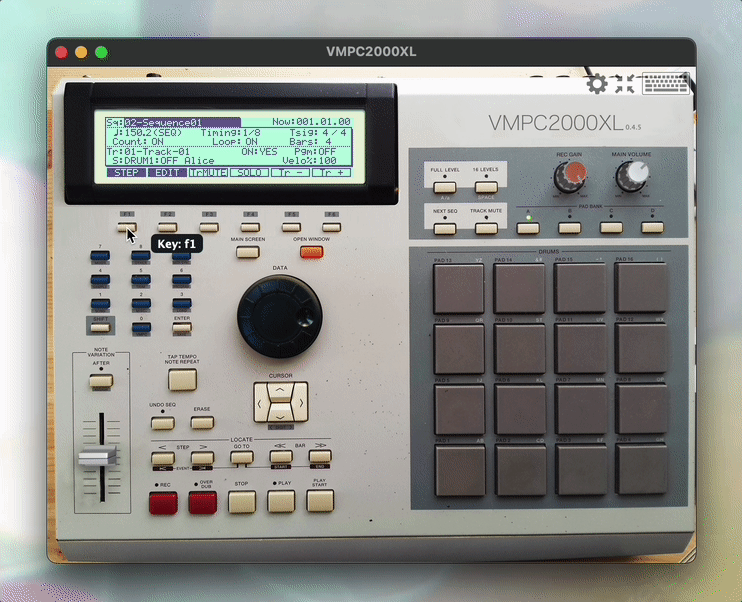
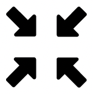
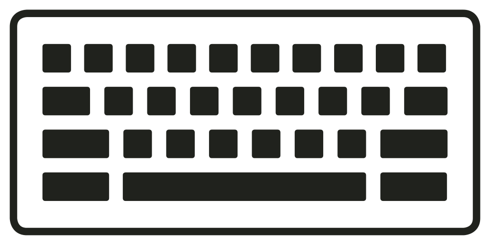
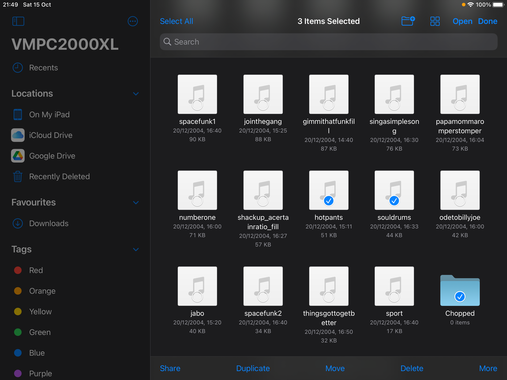
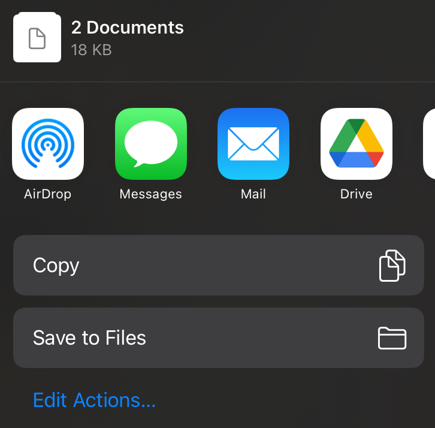
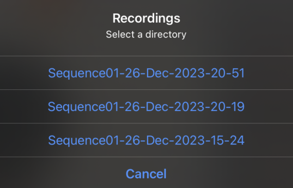
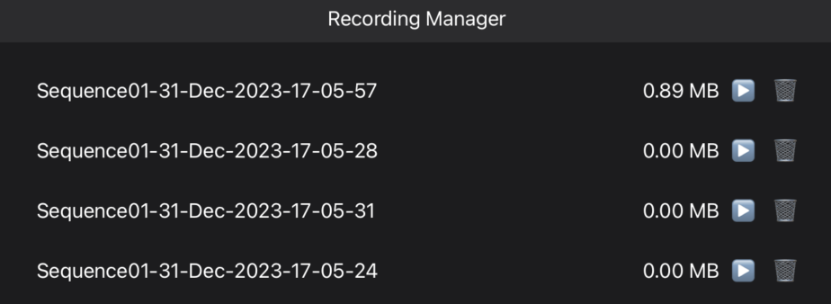

Controls
========

There are 3 ways to control VMPC2000XL:

* Keyboard
* Mouse/touchscreen
* MIDI

It is **strongly recommended** to get familiar with :ref:`basic keyboard shortcuts <basic_operations>` rather than relying on the mouse. The more keyboard shortcuts you use, likely the greater the sense of immersion.

Keyboard
--------
For most controls you can display a tooltip that shows you which key on the keyboard is associated with it. In the case of the DATA wheel it's 2 keys -- one for clockwise and one for anti-clockwise.

To display all controls' keys, hover over the keyboard icon in the bottom-right menu, or, if you're on iPadOS, you can long-press the keyboard icon.

To display just a single control's key in a tooltip, on systems with a mouse, hover over the control while holding one of the following keys on your keyboard: :kbd:`Shift`, :kbd:`Ctrl`, :kbd:`Alt/Option`, :kbd:`Cmd/Windows/Meta`. On iPadOS you can long-press a control, or long-press a pad with 2 fingers, to display its key.

It looks like this:

Below are the default keyboard shortcuts for most of the UI components.

Some letter keys are written in uppercase for disambiguation. For example, :code:`Record` is mapped to the letter :kbd:`L` and is written in uppercase to clarify it is not letter :kbd:`i` or number :kbd:`1`, so there is no need to press :kbd:`Shift` here. Special characters are clarified by appending their name in parentheses, for example :kbd:`; (semicolon)`.

.. note::

  The default keyboard mapping is geared towards US keyboard layout, but it's fully configurable. See :ref:`Configuring the keyboard <configuring_the_keyboard>` for instructions.

.. _basic_operations:

Basic operations
++++++++++++++++

===================== ==================
Operation             Key(s)
===================== ==================
Up, Down, Left, Right :kbd:`Up`/:kbd:`Down`/:kbd:`Left`/:kbd:`Right`
Data wheel plus       :kbd:`+` (to the left of the :kbd:`Tab` key)
Data wheel minus      :kbd:`-` (to the left of the :kbd:`Tab` key)
Numeric keypad        :kbd:`0` ... :kbd:`9`
Shift                 :kbd:`Left shift`
Record                :kbd:`L`
Overdub               :kbd:`;` (semicolon)
Stop                  :kbd:`'` (quote)
Play                  :kbd:`Space`
Play start            :kbd:`\\` (backslash)
F1 ... F6             :kbd:`F1` ... :kbd:`F6`
Main screen           :kbd:`Escape`
Open window           :kbd:`I`
===================== ==================

Hold one modifier -- :kbd:`Shift`, :kbd:`Ctrl`, or :kbd:`Alt/Option` -- to turn the DATA wheel 10 steps. Hold two modifiers to turn it 100 steps, and hold three to turn it 1000 steps. In the :code:`TRIM`, :code:`LOOP` and :code:`ZONE` screens, the number of steps per combination of modifiers is tailored to the sound length: the longer the sound, the bigger the number of steps.

Pads
++++

+--------+--------+--------+--------+
|:kbd:`g`|:kbd:`h`|:kbd:`j`|:kbd:`k`|
+--------+--------+--------+--------+
|:kbd:`b`|:kbd:`n`|:kbd:`m`|:kbd:`,`|
+--------+--------+--------+--------+
|:kbd:`a`|:kbd:`s`|:kbd:`d`|:kbd:`f`|
+--------+--------+--------+--------+
|:kbd:`z`|:kbd:`x`|:kbd:`c`|:kbd:`v`|
+--------+--------+--------+--------+

Advanced operations
+++++++++++++++++++

====================== =============
Operation              Key
====================== =============
Bank A                 :kbd:`Home`
Bank B                 :kbd:`End`
Bank C                 :kbd:`Insert`
Bank D                 :kbd:`Delete`
Previous step/event    :kbd:`Q`
Next step/event        :kbd:`W`
Locate/Go to           :kbd:`E`
Previous bar/Start     :kbd:`R`
Next bar/End           :kbd:`T`
Tap tempo/Note repeat  :kbd:`Y`
Erase                  :kbd:`F8`
Full level             :kbd:`O`
16 levels              :kbd:`P`
Next seq               :kbd:`[`
Track mute             :kbd:`]`
After/Assign           :kbd:`F9`
Undo seq               :kbd:`F10`
====================== =============

VMPC-specific operations
++++++++++++++++++++++++

======================= ================
Operation               Key
======================= ================
Direct-to-disk recorder :kbd:`Shift + L`
======================= ================

Mouse & touchscreen
-------------------

Pads
++++
The pads can be hit by clicking them with the mouse, or, if you have a touchscreen, by touching them. The closer to the top of the pad, the higher the velocity. When a pad is hit, it will light up blue.

Buttons
+++++++
All buttons can be pressed by clicking them with the mouse, or, if you have a touchscreen, by touching them.

DATA wheel
++++++++++
The DATA wheel can be turned by dragging or scrolling. Precise, single-step changes can be performed by holding any of the modifier keys -- :kbd:`Shift`, :kbd:`Ctrl`, or :kbd:`Alt/Option` -- while dragging.

On iPadOS you can drag the DATA wheel with one finger for precise, single-step changes, or with two fingers for large increments.

Slider/Rec gain/Main volume
+++++++++++++++++++++++++++
These controls can be operated by dragging or scrolling.

Note that, like on the original MPC2000XL, you can use the slider to change many of the values in the :code:`TRIM`, :code:`LOOP` and :code:`ZONE` screens, by holding :code:`SHIFT` while moving the slider.

.. note::

  If your mouse or touchpad emits momentum/inertia events, VMPC2000XL will process these accordingly. The DATA wheel, slider, record gain and main volume controls will come to a gradual stop.

Resize and Reset window size
++++++++++++++++++++++++++++
The first time you run VMPC2000XL it opens in its minimum window size, which is 649 x 497 plus the border that your operating system or DAW adds to it. This should fit on most computer screens. Then you have the option to resize it up to two times that resolution, making 1298 x 994. Resizing is done by dragging the bottom right corner of the window.

To reset the window size back to its minimum size, click the "Reset window size" button in the top-right.

   The "Reset window size" button

Configure computer keyboard
+++++++++++++++++++++++++++
Click the "Configure computer keyboard" icon in the top-right to go to the KEYBRD tab. See :ref:`Configuring the keyboard <configuring_the_keyboard>` for instructions.

   The "Configure computer keyboard" button

Hover over the button to show an overlay with all current keyboard mappings. Every keyboard-controllable component of VMPC2000XL's UI will temporarily show a glowing square with a description of the key that is mapped to it.

MIDI
----
Read more about MIDI control in the :ref:`MIDI control mode <midi_control_mode>` and :ref:`MIDI control <midi_control>` sections.

Import files and folders (iPadOS)
---------------------------------
Importing files and folders is the process of copying files from arbitrary locations on your iPad onto VMPC2000XL's default virtual disk volume.

   The "Import" button

After tapping the "Import" button, a document browser opens. Tap a file or folder to import it. Alternatively tap "Select" to perform a multi-selection:

   The document browser after tapping "Select"

Importing files from iCloud is fully supported.
Google Drive (and possibly other 3rd party cloud service providers) currently does not support importing folders.

After tapping a single file or folder, or after making a multi-selection and tapping "Open", you might see some quick graphics flashing. These are progress indicators. After each file is processed, you are back in VMPC2000XL.

When a file or folder already exists, you will be asked if you want to overwrite the existing file. You can also choose to overwrite none or all of the existing files of your selection.

The files and folders that you import are copied into the current directory as per your LOAD, SAVE and Directory screens. To check what your current directory is, press Shift + 3 to go to the :code:`LOAD` screen, and your current directory is mentioned in the top-right of the LCD.

.. _export_share_files_and_folders:

Export/share files and folders (iPadOS)
---------------------------------------
Exporting files and folders is the process of exposing files that are only accessible via VMPC2000XL. This includes any beats you made, sounds and other files in the virtual MPC2000XL volume, and direct-to-disk recordings.

   The "Export" button

After tapping the "Export" button, you are presented with the below options:

.. figure:: images/controls/ipados-export-options.png
   :width: 300 px
   :align: center

   The options after tapping the "Export" button

After tapping any of the options, you are greeted with the usual options when sharing things on your iPad, for example:

Share APS, SNDs and ALL of current project
++++++++++++++++++++++++++++++++++++++++++
With this option you can export/share the complete state of VMPC2000XL, including all programs, sounds and sequences that are currently in memory.

Share selected file/directory
+++++++++++++++++++++++++++++
This option will show up as "Share selected file" or "Share selected directory", depending on what is currently selected in the :code:`LOAD` screen (:kbd:`Shift + 3`). The name of the file/directory you're about to share is shown in the option. If you're sharing a directory, it will be shared as a ZIP archive.

Share Direct to Disk Recordings
+++++++++++++++++++++++++++++++
Any bounces/direct-to-disk recordings you have made via :ref:`direct-to-disk recording <direct_to_disk_recording>` can be shared via this option. Tapping this option will show you a list of your recordings:

Tap any of the recordings to export/share it as a ZIP archive.

.. _manage_recordings:

Manage Recordings (iPadOS)
--------------------------
Since the direct-to-disk recordings are not visible in the :code:`LOAD`, :code:`SAVE` and :code:`Directory` screens, we need some other way to remove them when we don't need them anymore. That's what the Recording Manager is for.

   The "Recording Manager" button

After tapping the "Recording Manager" button, you are presented with the following view:

   The Recording Manager

You can listen back to a recording by pressing the play button, and delete it by pressing the trashcan button.
