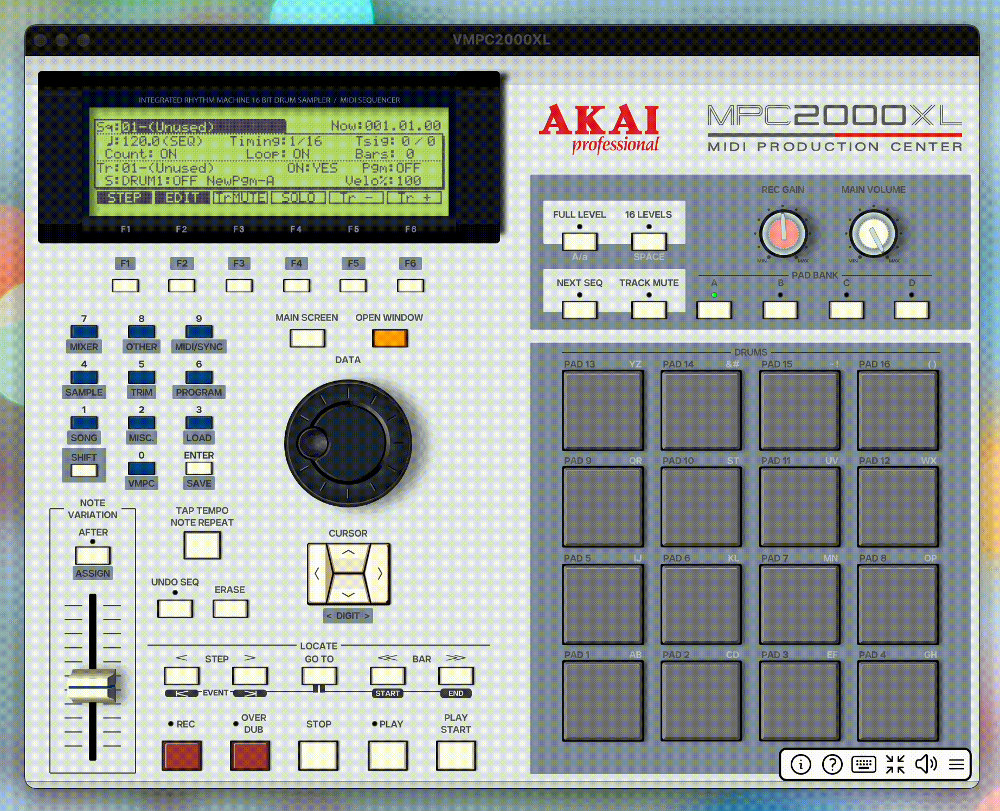
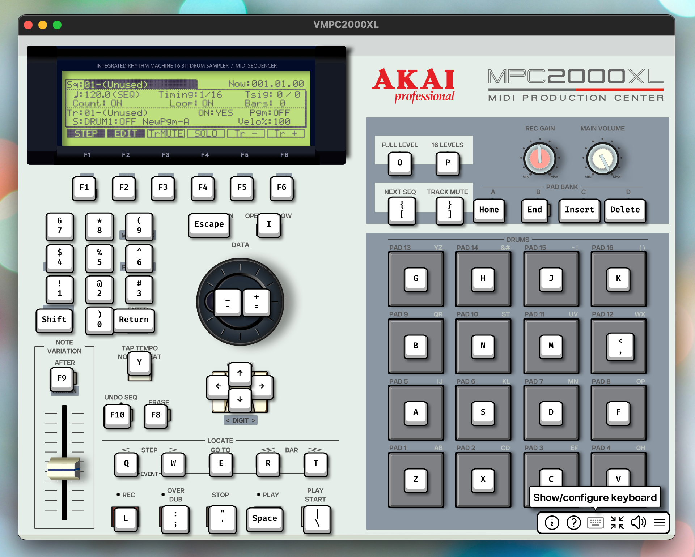

Controls
========

There are 3 ways to control VMPC2000XL:

* Keyboard
* Mouse/touchscreen
* MIDI

It is **strongly recommended** to get familiar with :ref:`basic keyboard shortcuts <basic_operations>` rather than relying on the mouse. The more keyboard shortcuts you use, likely the greater the sense of immersion.

Keyboard
--------
For most controls you can display a tooltip that shows you which key on the keyboard is associated with it. In the case of the DATA wheel it's 2 keys -- one for clockwise and one for anti-clockwise.

To display all controls' keys, hover over the keyboard icon in the bottom-right menu, or, if you're on iPadOS, you can long-press the keyboard icon.

To display just a single control's key in a tooltip, on systems with a mouse, hover over the control while holding one of the following keys on your keyboard: :kbd:`Shift`, :kbd:`Ctrl`, :kbd:`Alt/Option`, :kbd:`Cmd/Windows/Meta`. On iPadOS you can long-press a control, or long-press a pad with 2 fingers, to display its key.

It looks like this:

Below are the default keyboard shortcuts for most of the UI components.

Some letter keys are written in uppercase for disambiguation. For example, :code:`Record` is mapped to the letter :kbd:`L` and is written in uppercase to clarify it is not letter :kbd:`i` or number :kbd:`1`, so there is no need to press :kbd:`Shift` here. Special characters are clarified by appending their name in parentheses, for example :kbd:`; (semicolon)`.

.. note::

  The default keyboard mapping is geared towards US keyboard layout, but it's fully configurable. See :ref:`Configuring the keyboard <configuring_the_keyboard>` for instructions.

.. _basic_operations:

Basic operations
++++++++++++++++

===================== ==================
Operation             Key(s)
===================== ==================
Up, Down, Left, Right :kbd:`Up`/:kbd:`Down`/:kbd:`Left`/:kbd:`Right`
Data wheel plus       :kbd:`+` (to the left of the :kbd:`Tab` key)
Data wheel minus      :kbd:`-` (to the left of the :kbd:`Tab` key)
Numeric keypad        :kbd:`0` ... :kbd:`9`
Shift                 :kbd:`Left shift`
Record                :kbd:`L`
Overdub               :kbd:`;` (semicolon)
Stop                  :kbd:`'` (quote)
Play                  :kbd:`Space`
Play start            :kbd:`\\` (backslash)
F1 ... F6             :kbd:`F1` ... :kbd:`F6`
Main screen           :kbd:`Escape`
Open window           :kbd:`I`
===================== ==================

Hold one modifier -- :kbd:`Shift`, :kbd:`Ctrl`, or :kbd:`Alt/Option` -- to turn the DATA wheel 10 steps. Hold two modifiers to turn it 100 steps, and hold three to turn it 1000 steps. In the :code:`TRIM`, :code:`LOOP` and :code:`ZONE` screens, the number of steps per combination of modifiers is tailored to the sound length: the longer the sound, the bigger the number of steps.

Pads
++++

+--------+--------+--------+--------+
|:kbd:`g`|:kbd:`h`|:kbd:`j`|:kbd:`k`|
+--------+--------+--------+--------+
|:kbd:`b`|:kbd:`n`|:kbd:`m`|:kbd:`,`|
+--------+--------+--------+--------+
|:kbd:`a`|:kbd:`s`|:kbd:`d`|:kbd:`f`|
+--------+--------+--------+--------+
|:kbd:`z`|:kbd:`x`|:kbd:`c`|:kbd:`v`|
+--------+--------+--------+--------+

Advanced operations
+++++++++++++++++++

====================== =============
Operation              Key
====================== =============
Bank A                 :kbd:`Home`
Bank B                 :kbd:`End`
Bank C                 :kbd:`Insert`
Bank D                 :kbd:`Delete`
Previous step/event    :kbd:`Q`
Next step/event        :kbd:`W`
Locate/Go to           :kbd:`E`
Previous bar/Start     :kbd:`R`
Next bar/End           :kbd:`T`
Tap tempo/Note repeat  :kbd:`Y`
Erase                  :kbd:`F8`
Full level             :kbd:`O`
16 levels              :kbd:`P`
Next seq               :kbd:`[`
Track mute             :kbd:`]`
After/Assign           :kbd:`F9`
Undo seq               :kbd:`F10`
====================== =============

VMPC-specific operations
++++++++++++++++++++++++

======================= ================
Operation               Key
======================= ================
Direct-to-disk recorder :kbd:`Shift + L`
======================= ================

Mouse & touchscreen
-------------------

Pads
++++
The pads can be hit by clicking them with the mouse, or, if you have a touchscreen, by touching them. The closer to the top of the pad, the higher the velocity. When a pad is hit, it will light up blue.

Buttons
+++++++
All buttons can be pressed by clicking them with the mouse, or, if you have a touchscreen, by touching them.

DATA wheel
++++++++++
The DATA wheel can be turned by dragging or scrolling. Precise, single-step changes can be performed by holding any of the modifier keys -- :kbd:`Shift`, :kbd:`Ctrl`, or :kbd:`Alt/Option` -- while dragging.

On iPadOS you can drag the DATA wheel with one finger for precise, single-step changes, or with two fingers for large increments.

Slider/Rec gain/Main volume
+++++++++++++++++++++++++++
These controls can be operated by dragging or scrolling.

Note that, like on the original MPC2000XL, you can use the slider to change many of the values in the :code:`TRIM`, :code:`LOOP` and :code:`ZONE` screens, by holding :code:`SHIFT` while moving the slider.

.. note::

  If your mouse or touchpad emits momentum/inertia events, VMPC2000XL will process these accordingly. The DATA wheel, slider, record gain and main volume controls will come to a gradual stop.

Show/configure keyboard
+++++++++++++++++++++++
Click the "Show/configure keyboard" icon in the bottom-right menu to go to the :code:`KEYBRD` tab. See :ref:`Configuring the keyboard <configuring_the_keyboard>` for instructions.

.. figure:: images/controls/show-configure-keyboard.svg
   :scale: 550
   :align: center

   The "Show/configure keyboard" button

Hover over this button, or on iPadOS long-press it, to show an overlay with all current keyboard mappings:

MIDI
----
Read more about MIDI control in the :ref:`MIDI control mode <midi_control_mode>` and :ref:`MIDI control <midi_control>` sections.
