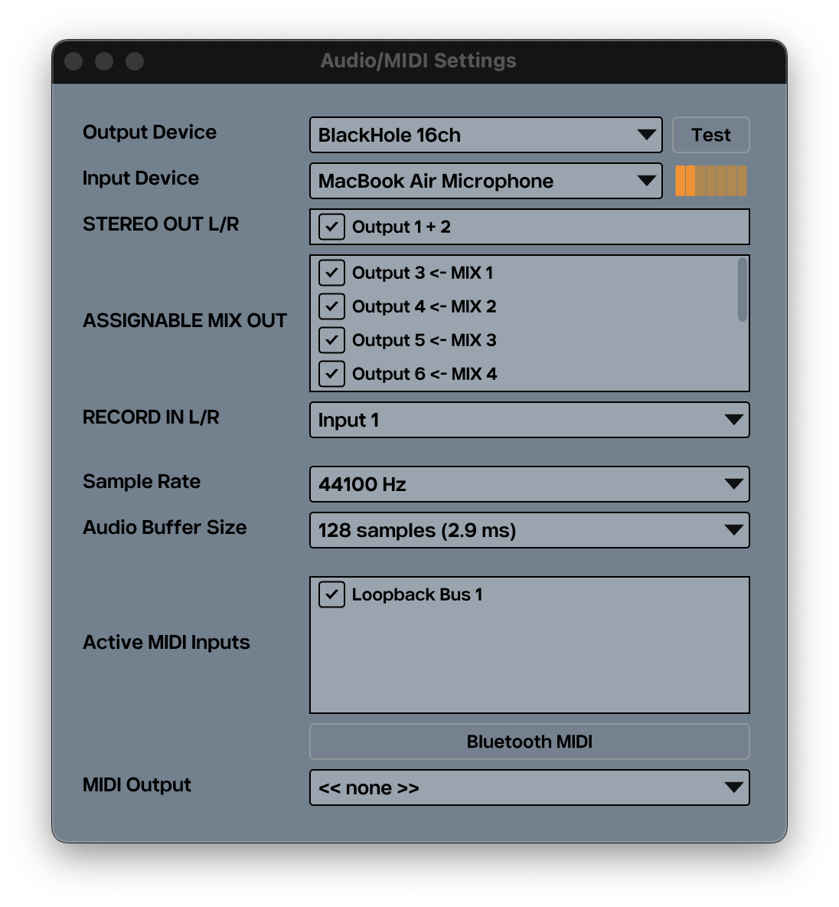

.. _getting_started:

Getting Started
===============

Starting VMPC2000XL
-------------------

Standalone
++++++++++

Linux
^^^^^
If you have installed VMPC2000XL via your package manager, you can run VMPC2000XL from anywhere in the terminal by typing :code:`VMPC2000XL` and pressing Enter.

If you have followed the recommendations of the :ref:`Manual installation (Ubuntu 20) <manual_installation_for_ubuntu>` section, your standalone application is in :file:`/usr/local/bin`. By default this path is in your :envvar:`PATH` environment variable, so you can run VMPC2000XL in the same way: type :code:`VMPC2000XL` and press Enter.

If you want to detach the process from the terminal completely, in order to use it for something else or close it, run :code:`VMPC2000XL &; disown`.

macOS
^^^^^
Navigate to :file:`/Applications` in Finder, locate :file:`VMPC2000XL` and double-click it. Alternatively use Spotlight and start typing "VMPC2000XL". Pretty soon the application shows up and you can press Enter to start it.

iPadOS
^^^^^^
After installing VMPC2000XL, tap the VMPC2000XL icon in your Home Screen to start it.

Windows
^^^^^^^
Open the Start Menu and start typing "VMPC2000XL". Pretty soon the application shows up and you can press Enter to start it.

Plugin (all platforms except iPadOS)
++++++++++++++++++++++++++++++++++++
If your DAW or plugin host is compatible with the format of VMPC2000XL that you installed (LV2, VST3, AUv2 or AUv3), it should detect VMPC2000XL as a software instrument. The AUv2 and AUv3 also come as effects, because in some cases, such as using the AUv3 in AUM, that's the only way to get audio input to work.

Please refer to your DAW's manual if you are not familiar with adding software instruments and effects to your projects.

For more information on capabilities and limitations within each plugin and DAW combination, consult `the plugin compatibility matrix <https://github.com/izzyreal/vmpc-juce/blob/master/plugin-compatibility-matrix.md>`_. The matrix is a must-read in case you run into any plugin issues, including those that are related to multiple outputs, keyboard shortcuts, and plugin window resizing.

Plugin (iPadOS)
+++++++++++++++
On iPadOS, VMPC2000XL comes as an AUv3 plugin. It can be used as an instrument, or as an effect plugin. The instrument gives you:

* Audio out: 5x stereo out, 8x mono out
* MIDI in/out

And the effect gives you:

* Audio in/out
* MIDI in

Most of the testing has been done in AUM, but in theory the AUv3 should work in other hosts too. In hosts other than AUM, you might see audio input working when using the instrument. In Logic on macOS this works via the Sidechain feature, so be sure to look at all the facilities the host offers before you give up on routing audio input into the instrument.

For more information on capabilities and limitations of the AUv3 in various hosts, consult `the plugin compatibility matrix <https://github.com/izzyreal/vmpc-juce/blob/master/plugin-compatibility-matrix.md>`_. The matrix is a must-read in case you run into any AUv3 issues, including those that are related to multiple outputs, keyboard shortcuts, and plugin window resizing.

.. _audio_midi_configuration:

Audio/MIDI configuration
------------------------
Standalone
++++++++++
When you start VMPC2000XL for the first time, it is highly recommended that you configure your audio and MIDI devices. Click on the speaker icon in the bottom-right menu.

   The Audio/MIDI Settings window

Audio output/input
^^^^^^^^^^^^^^^^^^
VMPC2000XL can function fine on audio output only, but this is also the absolute minimum you will need to configure correctly. Audio input and MIDI in/out can be configured to your liking.

Note that for audio out to work well, an audio device needs to be selected, as well as which output channels of this device you want to activate. If your device supports more than 2 mono outputs, VMPC2000XL can make use of them. Up to 10 mono outputs can be used simultaneously, congruent with an MPC2000XL that has the M208P output expansion board.

Up to 2 mono inputs can be activated at a time. A single mono input, such as the internal microphone of a MacBook, also works. Note, however, that such a mono input is treated by VMPC2000XL as a stereo input where both channels are the same.

Note that VMPC2000XL currently does not support advanced channel routing. The first 2 output channels of the selected device are used for the virtual MPC2000XL's STEREO OUT left and right channels. Any remaining output channels are used for the mono ASSIGNABLE MIX OUT channels, of which there may be a maximum of 8. The first 2 input channels of the selected device are used for the RECORD IN left and right channels. If you need advanced routing, please look into products from companies like VB-Audio and Rogue Amoeba. On Linux you could look into JACK. Alternatively use VMPC2000XL as a plugin, so you can rely on your DAW's audio routing capabilities.

.. note::

  On iPadOS, VMPC2000XL does not allow recording from Bluetooth devices, because this would result in a playback and recording sample rate of 16kHz. So, when you connect, for example, a pair of Bluetooth headphones that have a built-in mic, this built-in mic will be ignored, and VMPC2000XL will keep using the iPad's internal mic for recording new sounds, while playback will be going over the Bluetooth headphones.

Sample rate
^^^^^^^^^^^
The sample rate is generally best left at 44.1kHz or 48kHz, but you can run VMPC2000XL at any sample rate that suits your needs.

Audio buffer size
^^^^^^^^^^^^^^^^^
Keep the buffer size as low as possible. You generally want to keep the buffer size at 512 samples or below. The bigger the buffer size, the bigger the latency, meaning a bigger delay between triggering a pad and hearing its sound. On the other hand, if the buffer is too small, your audio will sound glitchy or garbled.

Below is an overview of the smallest buffer sizes that still work well on most modern systems:

* Windows Audio (WASAPI): 192
* Windows ASIO: 128
* macOS/iPadOS CoreAudio: 64
* Linux JACK: 128

.. note::

    These are approximations. Depending on what other software you are running and various system configurations, you may need a larger buffer, or maybe you can go lower than the suggested buffer sizes, without introducing audio artifacts. Use trial and error to find a glitch-free buffer size that suits your needs.

Plugin
++++++
When you open VMPC2000XL as a plugin in your DAW or plugin host, there are no audio/MIDI settings that can be configured in VMPC2000XL. It is your DAW/host that determines the buffer size and sample rate. If you notice a big delay between triggering a pad and hearing the sound, please refer to the documentation of your DAW/host to find out how to change the buffer size.

For some suggested buffer size settings, see `Audio buffer size`_.

.. note::

  If the :code:`PLAY` LED lights up but :code:`Now:001.01.00` does not start counting, this means that no valid audio output is configured. Verify your :ref:`audio output <audio_midi_configuration>` settings. If it does start counting, but you're not hearing any audio output while you should be hearing something, verify that you have made the desired output channels active by putting a checkmark in front of them in the "Active output channels" section of the Audio/MIDI Settings.

Loading the TEST1 sounds
------------------------
When you start VMPC2000XL for the first time, there are no sounds in memory. Let's load some sounds and assign them to a pad. In this section we will discuss two ways to achieve this:

#. Via the :code:`LOAD` screen
#. Drag-and-drop a WAV or SND file onto a pad

.. note::

  Another way to load sounds is by loading a :file:`PGM` or :file:`APS` file. After having learned how to load individual WAV or SND files via the :code:`LOAD` screen, it's easy to figure out how to load :file:`PGM`, :file:`APS` and other files. Please refer to the `MPC2000XL manual <https://www.platinumaudiolab.com/free_stuff/manuals/Akai/akai_mpc2000xl_manual.pdf>`_ (p164-167) to see the details of this process.

LOAD screen
+++++++++++
To open the :code:`LOAD` screen:

* Make sure the sequencer is not playing
* Press :kbd:`Shift + 3` simultaneously to open the :code:`LOAD` screen
* Press :kbd:`↓` to navigate to the :code:`File:` field
* Press :kbd:`-` or :kbd:`+` (to the left of :kbd:`Tab`), or drag the DATA wheel with the mouse, to change :code:`File:` to :file:`TEST1`

.. vmpc-lcd-screenshot:: images/getting_started/file_test1.png

* Press :kbd:`F6` to enter the :file:`TEST1` directory
* Turn the DATA wheel to change :code:`File:` to :file:`KICK1           .SND`

.. vmpc-lcd-screenshot:: images/getting_started/file_kick1.png

* Press :kbd:`F5` to play a preview of the sound
* Press :kbd:`F6` to open the :code:`Load a Sound` screen
* Click on pad 1 or press :kbd:`z` to set :code:`Assign to note:` to :code:`35/A01`

.. vmpc-lcd-screenshot:: images/getting_started/assign_to_note.png

* Press :code:`F5` to confirm

Now when you click pad 1 or press :code:`z` you should hear a kick drum.

Go through the same process for the :file:`HAT1` and :file:`SNARE4` sounds from the same directory, and you have assembled a basic kit.

Drag-and-drop
+++++++++++++
From your Operating System's file manager (Nautilus, Finder, File Explorer, etc.) drag **one** SND or WAV file onto a pad. This sound is now loaded into VMPC2000XL's memory, and assigned to the pad in your active program.
