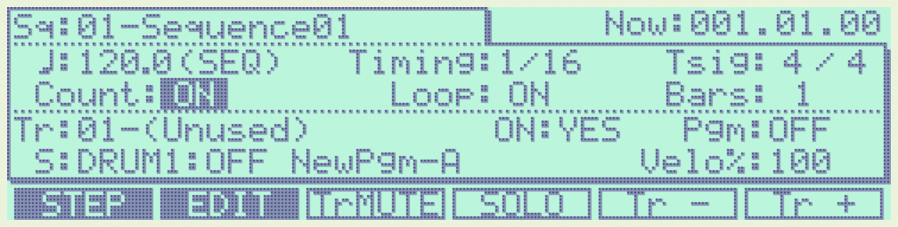
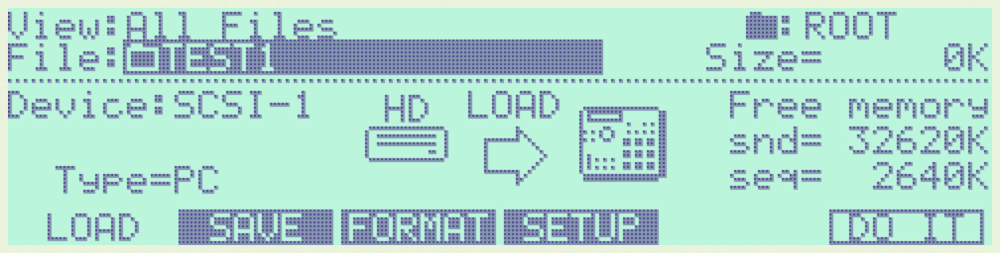
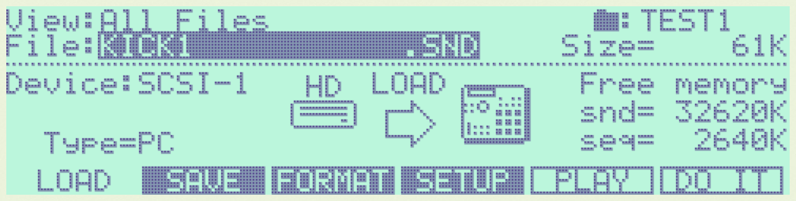
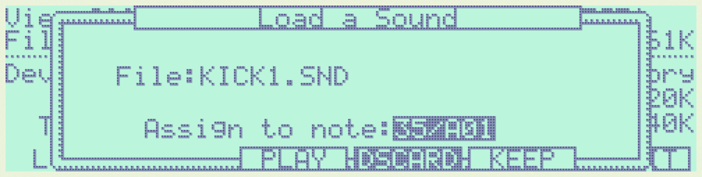

.. _getting_started:

Getting Started
===============

Let's get started with an example: We are going to create a beat with the TEST1 demo drum kit.

Starting VMPC2000XL
-------------------

Standalone
++++++++++

Linux
^^^^^
If you have followed the recommendations of the :ref:`Manual installation (Ubuntu 18) <manual_installation_for_ubuntu>` section, your standalone application is in :file:`/usr/local/bin`.

By default this path is in your :envvar:`PATH` environment variable, so you can run VMPC2000XL from anywhere in the terminal by typing :command:`VMPC2000XL` and pressing enter.

If you want to detach the process from the terminal completely, so you can use it for something else or close it, run :command:`VMPC2000XL &; disown`.

MacOS
^^^^^
Navigate to :file:`Applications` in Finder, locate :file:`VMPC2000XL` and double-click it. Alternatively use Spotlight and start typing "VMPC2000XL". Pretty soon the application shows up and you can press Enter to start it.

Windows
^^^^^^^
Open the Start Menu and start typing "VMPC2000XL". Pretty soon the application shows up and you can press Enter to start it.

Plugin
++++++
If your DAW or plugin host is compatible with the format of VMPC2000XL that you installed (LV2, VST3 or AU), it should detect VMPC2000XL as a software instrument with 10x mono audio out, 2x mono audio in and MIDI in/out.

Please refer to your DAW's manual if you are not familiar with adding software instruments to your projects.

.. _audio_midi_configuration:

Audio/MIDI configuration
------------------------

Standalone
++++++++++
When you start VMPC2000XL for the first time, you have to configure which audio and MIDI devices you want to use. Click on the :code:`Options` button in the top-left and click :code:`Audio/MIDI Settings`.

Audio output/input
^^^^^^^^^^^^^^^^^^
VMPC2000XL can function fine on audio output only, so this is the absolute minimum you will need to configure correctly. Audio input and MIDI in/out can be configured to your liking.

Note that an audio device needs to be selected, as well as which output channels of this device you want to activate. If your device supports more than 2 mono outputs, VMPC2000XL can make use of them. Up to 10 mono outputs can be used simultaneously, congruent with an MPC2000XL that has been fitted with the M208P 8 output expansion board.

Up to 2 mono inputs can be activated. A single mono input, such as the internal microphone of a MacBook, also works (though VMPC2000XL will treat this single input as a left channel and duplicate it to the right channel).

Sample rate
^^^^^^^^^^^
The sample rate is generally best left at 44.1KHz or 48KHz, but you can run VMPC2000XL at any sampling rate that suits your needs.

Audio buffer size
^^^^^^^^^^^^^^^^^
You generally want to keep the buffer size at 512 samples or below. The bigger the buffer size, the bigger the latency, meaning a bigger delay between triggering a pad and hearing its sound. On the other hand, if the buffer is too small, your audio will sound glitchy or garbled.

Below is an overview of the smallest buffer sizes that still work well on most modern systems:

* Windows Audio: 192
* Windows ASIO: 128
* MacOS CoreAudio: 64
* Linux JACK: 128

.. note::

    These are very rough approximations. Depending on what other software you are running and various system configurations, you may need a larger buffer, or maybe you can go lower than the suggested buffer sizes without audio artifacts.

Plugin
++++++
When you open VMPC2000XL as a plugin in your DAW or plugin host, there are no audio/MIDI settings that can be configured in VMPC2000XL. It is your DAW/host that determines the buffer size and sampling rate. If you notice a big delay between triggering a pad and hearing the sound, please refer to the documentation of your DAW/host to find out how to change the buffer size.

For some suggested buffer size settings, see `Audio buffer size`_.

.. _soundcheck:

Soundcheck - Hearing the metronome
----------------------------------
Now that we've configured our audio/MIDI settings, let's verify that VMPC2000XL's internal audio engine is running correctly.

An easy way to verify that your main stereo audio output is configured correctly, is by playing an empty sequence while the metronome is enabled. 

If you're not in the :code:`Main` screen, press the :code:`Esc` key to go there. Use the cursor keys to navigate to the :code:`Count:` field. Press the :code:`-` and :code:`+` keys, or drag the DATA wheel with the mouse, to change the value of :code:`Count:` to :code:`ON` like below:

Click the :code:`PLAY` button or press :code:`Space` to start playing the empty sequence. The green LED next to the :code:`PLAY` button should light up, :code:`Now:001.01.00` should start counting and you should hear a metronome click on every beat.

.. The :file: role below is not a typo. For some reason 2 backslashes appear when
   the :code: role is used.

Click the :code:`STOP` button or press :file:`\\` to stop the sequencer.

.. note::

  If the :code:`PLAY` LED lights up but :code:`Now:001.01.00` does not start counting, or if it starts counting but you don't hear the metronome, verify your :ref:`Audio output <audio_midi_configuration>` settings.

Loading the TEST1 sounds
------------------------
When you start VMPC2000XL for the first time, there are no sounds in memory. Let's load some sounds and assign them to a pad. In this section we will discuss two ways to achieve this:

1. Via the :code:`LOAD` screen
2. Drag-and-drop a WAV or SND file onto a pad

Another way to load sounds is by loading a :file:`PGM` or :file:`APS` file. After having learned how to load individual WAV or SND files in the section you are reading, it's fairly simple to figure out how to load :file:`PGM` and :file:`APS` files. Please refer to the `MPC2000XL manual <https://www.platinumaudiolab.com/free_stuff/manuals/Akai/akai_mpc2000xl_manual.pdf>`_ (p164-167) to see the details of this process.

LOAD screen
+++++++++++
To open the :code:`LOAD` screen:

* Make sure the sequencer is not playing
* Press :code:`Shift` and :code:`3` simultaneously to open the :code:`LOAD` screen
* Press the ↓ key to navigate to the :code:`File:` field
* Press the :code:`-` and :code:`+` keys, or drag the DATA wheel with the mouse, to change :code:`File:` to :file:`TEST1`

* Press :code:`F6` to enter the :file:`TEST1` directory
* Turn the DATA wheel to change :code:`File:` to :file:`KICK1           .SND`

* Press :code:`F5` to play a preview of the sound
* Press :code:`F6` to open the :code:`Load a Sound` screen
* Click on pad 1 or press :code:`z` to change the :code:`Assign to note:` to :code:`35/A01`

* Press :code:`F5` to confirm

Now when you click pad 1 or press :code:`z` you should hear a kick drum.

Go through the same process for the :file:`HAT1` and :file:`SNARE4` sounds from the same directory and you have assembled a basic kit.

Drag-and-drop
+++++++++++++
From your Operating System's file manager (Nautilus, Finder, File Explorer, etc.) drag **one** SND or WAV file onto a pad. This sound is now loaded into VMPC2000XL's memory, and assigned to the pad in your active program.