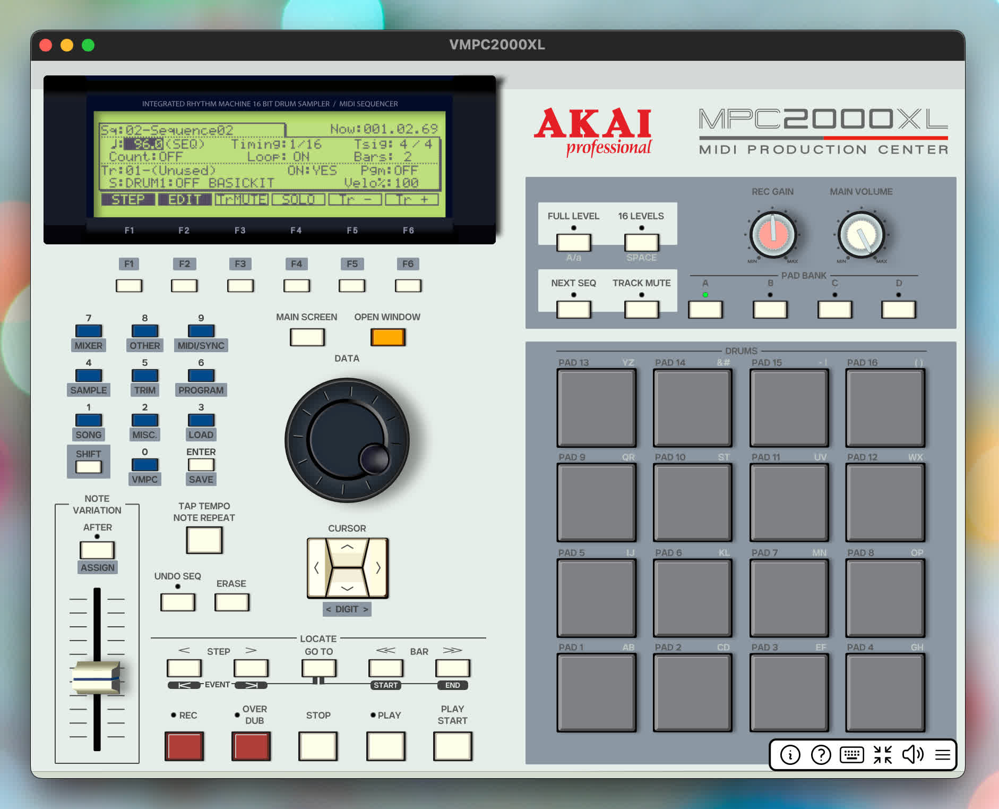

Welcome to VMPC2000XL Documentation
===================================

`VMPC2000XL <https://izmar.nl>`_ is an emulator of the `Akai MPC2000XL <https://www.akaipro.com/mpc2000xl>`_ sampling sequencer, intended for vintage studio equipment enthousiasts.

VMPC2000XL comes in standalone desktop application, as well as DAW plugin formats for Linux, macOS, iPadOS and Windows. The recommended mode of use is very much like how the original MPC2000XL was intended -- as the centerpiece of your project. This workflow can be achieved most easily when using the standalone desktop variety of VMPC2000XL.

It is highly suitable for those who want to experience what it was like to create beats before modern music production software became ubiquitous, whether for nostalgia or for actually creating beats for further processing in a modern DAW.

VMPC2000XL is completely `free and open source <https://github.com/izzyreal/vmpc-juce>`_. Contributions are highly welcome! Contact Izmar if you are interested. Contributions are welcomed in the form of code, graphics, website maintenance, documentation, forum moderation and more.

.. toctree::
   :maxdepth: 2

   introduction
   install
   getting_started
   controls
   vmpc_specific_settings
