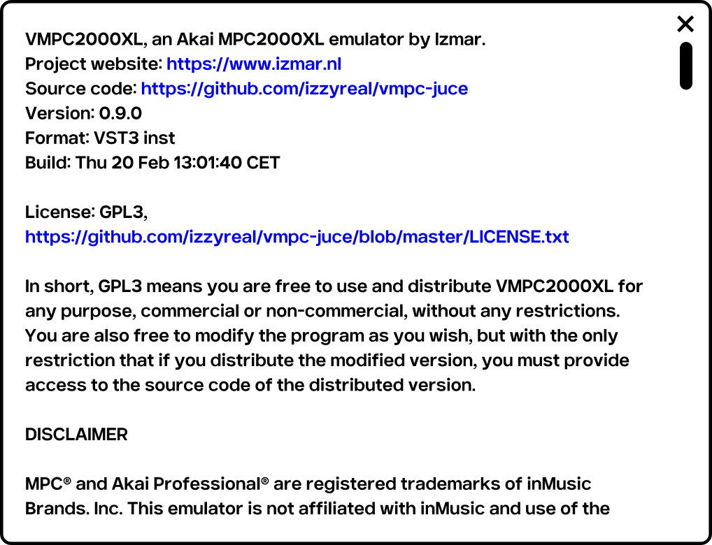
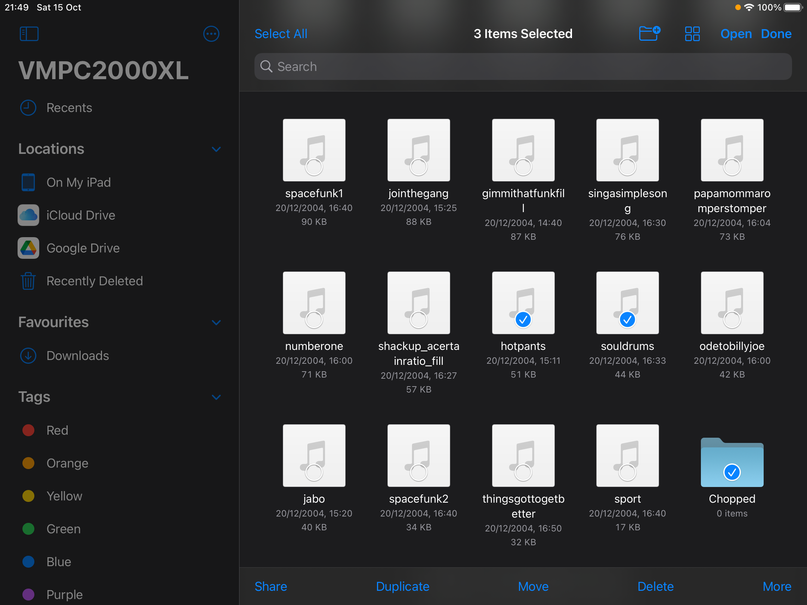
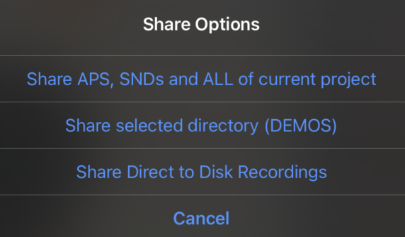
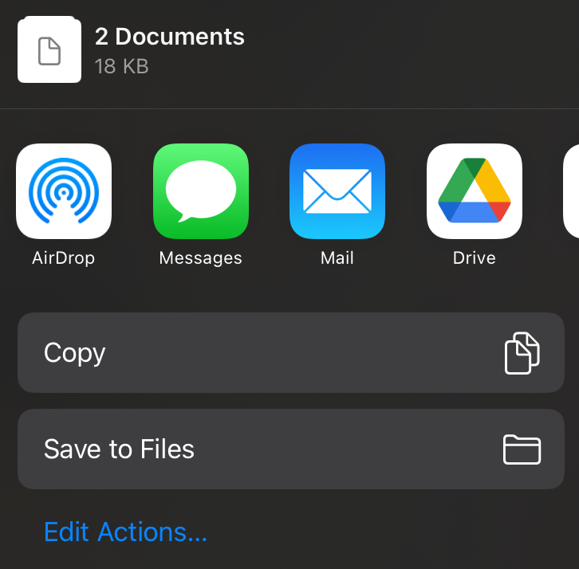
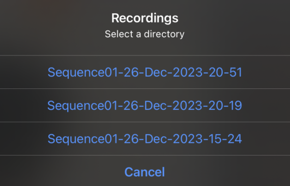
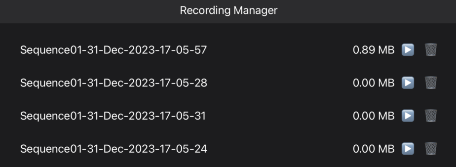

VMPC2000XL Specific Settings & Functionality
============================================

In this section we will discuss settings and functionality that can't be found on the real MPC2000XL.

.. _the_about_window:

The About window
----------------
To open the About window, click the "About" button in the bottom-right menu.

   The "About" button

Here you can find acknowledgements, version/build/format information, as well as licensing information about VMPC2000XL and its dependencies.

"About" gives you a quick way to make sure which version of VMPC2000XL you're running, and whether you're running the VST3, Audio Unit or LV2 in case you have multiple plugin formats installed.

The "Format:" field will also indicate whether you're running the instrument or the effect. Note that VST3 and LV2 only come as instruments, so this detail is most useful to those running the Audio Unit, which comes as instrument as well as effect.

There are some basic text file viewer operations available in the About window:

* Scrolling via the scrollbar.
* Scrolling via the mouse wheel/trackpad.
* Text selection by dragging from start to end with the mouse.
* Copy selection to clipboard by pressing :kbd:`Ctrl + C` or :kbd:`Cmd + C`.
* Closing About by clicking the X in the top-right, or clicking outside the About window.

   The About window

Restore default window size
+++++++++++++++++++++++++++
The first time you run VMPC2000XL, it determines a suitable default window size based on your display's dimensions. After that, you can resize VMPC2000XL's windown to any size you prefer. The window size and position are saved when you exit VMPC2000XL, and they are restored the next time you run VMPC2000XL. 

To get the window back to its default size, click the "Restore default window size" button in the bottom-right menu.

.. figure:: images/vmpc_specific/restore-default-window-size.svg
   :scale: 200 
   :align: center

   The "Restore default window size" button

Import files and folders (iPadOS)
---------------------------------
Importing files and folders is the process of copying files from arbitrary locations on your iPad onto VMPC2000XL's default virtual disk volume.

   The "Import" button

After tapping the "Import" button, a document browser opens. Tap a file or folder to import it. Alternatively tap "Select" to perform a multi-selection:

   The document browser after tapping "Select"

Importing files from iCloud is fully supported.
Google Drive (and possibly other 3rd party cloud service providers) currently does not support importing folders.

After tapping a single file or folder, or after making a multi-selection and tapping "Open", you might see some quick graphics flashing. These are progress indicators. After each file is processed, you are back in VMPC2000XL.

When a file or folder already exists, you will be asked if you want to overwrite the existing file. You can also choose to overwrite none or all of the existing files of your selection.

The files and folders that you import are copied into the current directory as per your LOAD, SAVE and Directory screens. To check what your current directory is, press Shift + 3 to go to the :code:`LOAD` screen, and your current directory is mentioned in the top-right of the LCD.

.. _export_share_files_and_folders:

Export/share files and folders (iPadOS)
---------------------------------------
Exporting files and folders is the process of exposing files that are only accessible via VMPC2000XL. This includes any beats you made, sounds and other files in the virtual MPC2000XL volume, and direct-to-disk recordings.

   The "Export" button

After tapping the "Export" button, you have these options:

   The options after tapping the "Export" button

After tapping any of the options, you have the usual options when sharing things on your iPad, for example:

   The options right before exporting

Share APS, SNDs and ALL of current project
++++++++++++++++++++++++++++++++++++++++++
With this option you can export/share the complete state of VMPC2000XL, including all programs, sounds and sequences that are currently in memory.

Share selected file/directory
+++++++++++++++++++++++++++++
This option will show up as "Share selected file" or "Share selected directory", depending on what is currently selected in the :code:`LOAD` screen (:kbd:`Shift + 3`). The name of the file/directory you're about to share is shown in the option. If you're sharing a directory, it will be shared as a ZIP archive.

Share Direct to Disk Recordings
+++++++++++++++++++++++++++++++
Any bounces/direct-to-disk recordings you have made via :ref:`direct-to-disk recording <direct_to_disk_recording>` can be shared via this option. Tapping this option will show you a list of your recordings, where you can tap any of the recordings to export/share it as a ZIP archive:

   Example direct-to-disk recording sharing options

.. _manage_recordings:

Manage Recordings (iPadOS)
--------------------------
Since the direct-to-disk recordings are not visible in the :code:`LOAD`, :code:`SAVE` and :code:`Directory` screens, we need some other way to remove them when we don't need them anymore. That's what the Recording Manager is for.

   The "Recording Manager" button

After tapping the "Recording Manager" button, you are presented with the following view:

   The Recording Manager

You can listen back to a recording by pressing the play button, and delete it by pressing the trashcan button.

Normalize
---------
Sometimes you want to boost the volume of soft (portions of) sounds.

When you're in the :code:`TRIM`, :code:`LOOP` or :code:`ZONE` screen, you can normalize the selection to 100% by following these steps:

1. Press :kbd:`F5` to open the :code:`Edit` window
2. Select :code:`NORMALIZE`
3. Press :kbd:`F5` to normalize

.. _direct_to_disk_recording:

Direct-to-disk recording a.k.a. bouncing
----------------------------------------

VMPC2000XL allows various ways to record your beats and other projects directly to disk as WAV files. Often this is referred to as bouncing or rendering. This way you can take your VMPC2000XL creations to a DAW or sample editor for further processing.

You might for example want to master your instrumental beats by processing them with EQs, compressors and so on before sending them to someone who will add a vocal track on top. Or maybe you like to make drum tracks with VMPC2000XL, but you want to add synths and other layers in a DAW.

Press :kbd:`Shift + <PLAY START>` to access the :code:`Direct-to-Disk Recorder` screen. On a default US keyboard mapping the exact keyboard shortcut is :kbd:`Shift + \\`. You can also press and hold :kbd:`Shift` on your computer keyboard and click the :code:`PLAY START` button with the mouse.

The :code:`Direct-to-Disk Recorder` screen looks like this:

.. vmpc-lcd-screenshot:: images/vmpc_specific/direct_to_disk_recorder.png

In the :code:`Record:` field you can select what to record: a :code:`SEQUENCE`, a :code:`LOOP` (i.e. the part of a sequence as selected in the :code:`Loop` window that is accessed via the :code:`MAIN` screen), a :code:`CUSTOM RANGE` or a :code:`SONG`. There's also a :code:`JAM` option, which lets you record VMPC2000XL's audio regardless of what you're doing. You might practice a liveset, or simply jam a bit with the pads and record what you hear with this setting. 

In the :code:`Offline:` field select :code:`YES` to enable silent, non-realtime rendering. This allows you to record even a few minutes worth of material in a matter of seconds, depending on the performance of your computer.

When recording has finished the following screen appears:

.. vmpc-lcd-screenshot:: images/vmpc_specific/recording_finished.png

In the :file:`~/Documents/VMPC2000XL/Recordings` directory, you will find a directory for each recording you made.

.. note:: If a recording resulted in a total silence, there will only be an empty directory created inside the :file:`Recordings` directory. 

The SETNGS tab
--------------
Press :kbd:`Shift + 0` to go to the :code:`SETNGS` tab.

.. _initial_pad_mapping:

Initial pad mapping
+++++++++++++++++++
The way all MPCs work, is that each pad can be assigned a MIDI note number, and a note number can be assigned a sound, envelope settings and more. For a pad to play a sound, a MIDI note has to be assigned to it. This information is stored in programs and their associated :file:`PGM` files.

When a new program is created on the MPC2000XL, its default MIDI note mapping is pretty confusing. See https://www.mpc2000xl.com/pads.htm.

There are rumours this mapping stems from `General MIDI <https://en.wikipedia.org/wiki/General_MIDI#Percussion>`_. Whatever its origins, it causes confusion the moment you connect a MIDI keyboard to the real MPC2000XL. In this scenario, a typical expectation is that adjacent keys on the connected MIDI device trigger adjacent pads on the MPC2000XL. Instead, pad 1 is triggered by note 37, pad 2 by note 36, pad 3 by note 42, pad 4 by note 82, etc.

For this reason, contrary to the real MPC2000XL, VMPC2000XL defaults to a chromatic mapping: 35, 36, 37, 38 ... 95, 96, 97, 98 for pads 1, 2, 3, 4 ... 61, 62, 63, 64. You can verify that this is the configured initial pad mapping in the :code:`SETNGS` tab. The :code:`Initial pad mapping:` field should be set to :code:`VMPC2000XL` like below:

.. vmpc-lcd-screenshot:: images/vmpc_specific/initial_pad_mapping.png

To get the original "confusing" pad mapping, set :code:`Initial pad mapping:` to :code:`ORIGINAL`.

.. note:: Changes to this field are only applied to programs that are created after the change.

16 levels erase mode
++++++++++++++++++++
When 16 levels is enabled (see the green LED below :code:`16 LEVELS` in the top-right), the sequencer is running and the user holds the :code:`ERASE` button and any of the pads, the real MPC2000XL will erase all recorded note events that match the note that you set in the :code:`Assign 16 levels` window.

If this is what you want, leave the :code:`16 levels erase mode` field at its default setting: :code:`All levels`.

If you only want to erase note events that match the level of the pad you're pressing, set this field to :code:`Only pressed level` like below:

.. vmpc-lcd-screenshot:: images/vmpc_specific/16_levels_erase_mode.png

Auto-convert WAVs
+++++++++++++++++
VMPC2000XL has the ability to convert PCM WAV files that are unsupported on the original MPC2000XL to a supported format. Eligible are 24- and 32-bit WAV files, as well as WAVs with a sampling rate over 44100Hz.

By default VMPC2000XL will always try to convert WAV files to a supported format. If you prefer to get a dialog instead, so you are aware of such conversions, set :code:`Auto-convert WAVs` to :code:`ASK`.

.. vmpc-lcd-screenshot:: images/vmpc_specific/auto_convert_wavs.png

.. _midi_control_mode:

MIDI control mode
+++++++++++++++++

VMPC2000XL supports 2 different modes in terms of MIDI controllability:

#. :code:`VMPC`. This is the default mode. In this mode you can use predefined or customized MIDI control presets that match your MIDI controller. Contrary to the real MPC2000XL, this mode allows you to control all buttons, all pads, the slider, and the DATA wheel via MIDI. The default preset maps notes 35 to 50 from any MIDI channel to pads 1 - 16, and control change 7 from any channel to the Note Variation Slider. For more details, scroll through the full list of mappings in the :code:`MIDI` tab by pressing :kbd:`F5` in the :code:`SETNGS` screen. Continue reading below in the :ref:`MIDI control <midi_control>` section, in order to see what can be configured and how.

#. :code:`ORIGINAL`. VMPC2000XL will respond like the original would. This means that incoming MIDI note events will be routed to pads according to how you've programmed your pad-to-MIDI note associations in the program :code:`ASSIGN` screen (:kbd:`Shift + 6`, and then :kbd:`F1`, :kbd:`F2`, :kbd:`F3` or :kbd:`F4`). It also means that many buttons will not be controllable. Please refer to the `MPC2000XL manual <https://www.platinumaudiolab.com/free_stuff/manuals/Akai/akai_mpc2000xl_manual.pdf>`_ (p185) to see the details of assigning MIDI Continuous Controllers to MPC2000XL functionality in this mode, which is done via the :code:`MIDIsw` screen.

.. vmpc-lcd-screenshot:: images/vmpc_specific/midi_control_mode.png

.. _configuring_the_keyboard:

Configuring the keyboard in the KEYBRD tab
------------------------------------------
After pressing :kbd:`Shift + 0`, press :kbd:`F2` to go to the :code:`KEYBRD` tab.

If you can't use the keyboard as expected, you can also click the keyboard icon in the top-right of the window.

.. vmpc-lcd-screenshot:: images/vmpc_specific/keyboard_tab.png

Once you are in the :code:`KEYBRD` tab, VMPC2000XL internally switches to a restricted keyboard input mode that ignores any keyboard configuration you may have. The only keys that work in this tab are:

* :kbd:`Up`
* :kbd:`Down`
* :kbd:`F1` ... :kbd:`F6`

You can also use the mouse to interact with the :kbd:`Up`/:kbd:`Down` cursors and :kbd:`F1` ... :kbd:`F6` buttons in the UI as usual.

Changing a mapping
++++++++++++++++++

Use :kbd:`Up` and :kbd:`Down` to scroll through the list of functions. To change one of the mappings, highlight the mapping and press :kbd:`F4`. The UI will change to indicate that learn mode is active. Some elements start blinking to indicate that VMPC2000XL is awaiting your keypress:

.. vmpc-lcd-screenshot:: images/vmpc_specific/keyboard_tab_learn.gif

As long as the elements are blinking and you see :code:`CANCEL` and :code:`ACCEPT`, you can press another key that you wish to assign to the selected function.

**To accept your new key you have to use the mouse or touchpad and click** :kbd:`F4`. To cancel the learning process, use the mouse or touchpad and click :kbd:`F3`.

Reset mapping to default
++++++++++++++++++++++++

To go back to the original mapping that is based on the US keyboard layout, press :kbd:`F5`:

.. vmpc-lcd-screenshot:: images/vmpc_specific/reset_keyboard_mapping.png

Saving mapping changes
++++++++++++++++++++++

Press :kbd:`F6` to save your changes. A popup will appear saying "Keyboard mapping saved". You can return to the :code:`Main` screen by pressing :kbd:`Esc` and continue normal operation.

If your configuration is the same as what it was, a popup will appear saying "Keyboard mapping unchanged":

.. vmpc-lcd-screenshot:: images/vmpc_specific/keyboard_mapping_unchanged.png

Discard mapping changes
+++++++++++++++++++++++

To discard the changes you made in the :code:`KEYBRD` screen, press :kbd:`Esc` or click the :kbd:`MAIN SCREEN` button. If you actually have unsaved changes, the following window appears:

.. vmpc-lcd-screenshot:: images/vmpc_specific/discard_mapping_changes.png

Besides discarding your changes, you can choose to stay in the :code:`KEYBRD` screen and continue making changes, or you can save your changes, after which you'll go to the :code:`Main` screen.

Configuring auto-save in the AUTSAV tab
---------------------------------------
After pressing :kbd:`Shift + 0`, press :kbd:`F3` to go to the :code:`AUTSAV` tab.

Though auto-save also happens when running VMPC2000XL as a plugin, these settings **only affect behaviour of the standalone version**.

The following aspects are part of the state that is saved and loaded as part of this feature in both standalone and plugin versions of VMPC2000XL:

* All programs and sounds
* All sequences
* Current screen
* Current focus in that screen
* Current sound selection (in :code:`TRIM`, :code:`LOOP`, :code:`ZONE`, and :code:`PARAMS` screens)
* Current directory selection (in :code:`LOAD`, :code:`Directory`, and :code:`SAVE` screens)

.. warning::

  Since all sounds are stored in your DAW project files, be aware of their combined size. If you have 32MB of sounds in memory, your project file will become 32MB bigger.

There are 2 auto-save modes:

* Disabled
* Enabled

and there are 3 auto-load modes:

* Disabled
* Ask
* Enabled

The default configuration is to enable auto-save, and to ask whether the user wants to auto-load the last saved state.

When :code:`Auto-load on start:` is set to :code:`Ask`, the following dialog appears upon startup if an auto-saved session is detected:

.. vmpc-lcd-screenshot:: images/vmpc_specific/continue_previous_session.png

Configuring (USB) disk devices in the DISKS tab
-----------------------------------------------
.. warning::

  Read the instructions carefully to avoid corrupting CF cards and other media. Make backups if you're working with important data that you have no other copies of.

After pressing :kbd:`Shift + 0`, press :kbd:`F4` to go to the :code:`DISKS` tab. The default configuration is like this:

.. vmpc-lcd-screenshot:: images/vmpc_specific/default_disks_configuration.png

The DEFAULT volume
++++++++++++++++++

The :code:`DEFAULT` volume is the default directory where VMPC2000XL stores user data, including your sounds, programs and sequences. It is located in :file:`~/Documents/VMPC2000XL/Volumes/MPC2000XL`. This volume ensures VMPC2000XL is always in a useful state with regard to loading and saving SND, PGM and other files.

This behaviour deviates from the real MPC2000XL, in the sense that if no disk drive, CF reader or other disk device is connected to the real MPC2000XL, you will not be able to load or save anything.

The :code:`Mode` setting for the :code:`DEFAULT` volume can't be changed. It is always set to :code:`READ/WRITE`.

.. warning::

  Any files placed in the :code:`DEFAULT` directory will be renamed to names that are compatible with the Akai FAT16 filesystem. For example, :file:`Fantastic Bassdrum 14.wav` will become :file:`FANTASTICBASSDRU.WAV`. This is a destructive operation, meaning that the file in this location will be permanently renamed. For this reason it is recommended to always **keep a copy of the original files elsewhere**. Never assume you can copy files from this directory back into where you copied them from.

Raw USB volumes (Linux, macOS and Windows only)
+++++++++++++++++++++++++++++++++++++++++++++++
Raw USB access lets VMPC2000XL directly access your MPC2000XL CF cards. This is useful for those who own a real MPC2000XL, and who want to use up to 16 characters for sound names, rather than up to 8.

If you plan to use raw USB access, on macOS use my `FAT16 Mount Blocker <https://github.com/izzyreal/macos-fat16-mount-blocker/releases/download/0.9/FAT16.Mount.Blocker-0.9.dmg>`_, and on Windows use my `registry patch <https://github.com/izzyreal/win-disable-usbdrive-indexing>`_. Read about these tools on their respective URLs. Note that these tools can also be used independently from VMPC2000XL, by MPC2000XL users who want to be able to access MPC2000XL CF cards and other media on their desktop computer, without corrupting their data.

To my knowledge on most Linux distributions no special tools are necessary to prevent corruption of MPC2000XL media, but you must still stick to the principle of not performing any write operations (including creating, deleting and updating files) outside VMPC2000XL.

Akai's MPC2000XL FAT16 filesystem
^^^^^^^^^^^^^^^^^^^^^^^^^^^^^^^^^

.. note:: This section is only relevant for those who want to exchange files between a real MPC2000XL and their computer.

The real MPC2000XL uses a slightly customized implementation of `FAT16 <https://www.win.tue.nl/~aeb/linux/fs/fat/fat-1.html>`_. In Akai's implementation, 8 bytes of each FAT directory entry that are ordinarily reserved for attributes like creation and last access date/time, are used to store 8 additional characters for the filename.

It is via this customization that the MPC2000XL has 16.3 filenames rather than 8.3 in a single FAT16 entry. The only problem, however, is that this leaves the MPC2000XL user in a kind of limbo state with regard to file exchange. Any Mac, Windows or Linux machine can read an MPC2000XL CF card without complaining, but it will not be able to parse the filenames correctly. It will register the 8 additional bytes as invalid date/time values, since that is what these bytes are expected to mean in a FAT16 filesystem.

For this reason, an MPC2000XL CF card with, for example, a :file:`DRUMKIT.PGM` that refers to a :file:`FUNKY_SNARE1.SND` will not be copied correctly to most computers. Likely you will end up with a file named :file:`FUNKY_SN.SND`.

What's worse, Windows and macOS have a tendency to rewrite the FAT entries of any volume that is connected to your system. This results in permanent truncation file names. For example, :file:`FUNKY_SNARE1.SND` will become :file:`FUNKY_SN.SND`. If you have :file:`PGM` files referring to :file:`FUNKY_SNARE1.SND`, loading such program files will result in failure to find the :file:`SND` file.

.. note:: To avoid corrupting MPC2000XL data on a CF card, your options are:

  #. Never insert the CF card in a USB reader connected to your computer.
  #. Use up to 8 characters for the names of your sounds.
  #. Use `FAT16 Mount Blocker <https://github.com/izzyreal/macos-fat16-mount-blocker/releases/download/0.9/FAT16.Mount.Blocker-0.9.dmg>`_ for macOS.
  #. Use this `registry patch <https://github.com/izzyreal/win-disable-usbdrive-indexing>`_ for Windows.

.. warning:: Always keep backups of important work! If you don't have a hotswappable CF reader or SCSI harddrive connected to your MPC2000XL, your best bet for making backups is a Linux computer, or a Mac that is running `FAT16 Mount Blocker <https://github.com/izzyreal/macos-fat16-mount-blocker/releases/download/0.9/FAT16.Mount.Blocker-0.9.dmg>`_.

Raw USB volume access under the hood
^^^^^^^^^^^^^^^^^^^^^^^^^^^^^^^^^^^^
Raw USB volume access allows VMPC2000XL to read an MPC2000XL CF card almost like the MPC2000XL itself, meaning you can load and save PGM and APS files that refer to sounds with long names over 8 characters.

This type of access is achieved by performing the following steps:

#. VMPC2000XL unmounts a USB volume from the operating system, i.e. macOS, Windows or Linux.
#. VMPC2000XL requests the operating system to provide it with exclusive access to the USB volume.
#. VMPC2000XL can now read from and write to the USB volume at the byte level, circumventing the operating system's FAT16 implementation.
#. VMPC2000XL gives up exclusive access to the USB volume.
#. VMPC2000XL mounts the USB volume back to the operating system.

Steps 1, 2, 4 and 5 are only performed when necessary, which is typically at application startup and shutdown, as well as the first time the user configures a particular USB volume in VMPC2000XL.

Also note that step 2 and 4 require elevated permissions, so **you need to be a system administrator to make use of this functionality**.

Enabling a USB volume
^^^^^^^^^^^^^^^^^^^^^
When you first connect a USB pendrive or CF card with a FAT16 volume, the configuration in the DISKS screen will look like this:

.. vmpc-lcd-screenshot:: images/vmpc_specific/default_disks_configuration_usb_disabled.png

.. note:: Every time you go to the :code:`DISKS` screen, VMPC2000XL will try to detect which USB volumes you have connected. There is no need to restart VMPC2000XL. If you happen to be in the :code:`DISKS` screen while connecting a USB volume, go to another screen and go back to :code:`DISKS` to refresh the list of volumes.

Navigate to the volume you want to enable and set its :code:`Mode` to :code:`READ-ONLY` or :code:`READ/WRITE`. If you want to make sure your volume is not altered by VMPC2000XL, set it to :code:`READ-ONLY`. When you are done configuring your volume(s), press :kbd:`F6` to save the configuration.

Any enabled volumes will now be available in the :code:`LOAD` screen's :code:`Device:` field. The volume name will be used to identify each volume. Where the real MPC2000XL makes SCSI and other connected devices instantly active as you cycle through them, one additional action is required on VMPC2000XL to make a volume active -- pressing :kbd:`F5` to :code:`APPLY` that setting:

.. vmpc-lcd-screenshot:: images/vmpc_specific/load_apply.png

If after pressing :code:`APPLY` no error messages appear, your USB volume is ready to use.

VMPC2000XL remembers configurations for any USB volumes that have been previously connected and enabled, as well as the :code:`Device:` you used in the last session. In other words, after a restart it is easy to continue using your USB volume (though you may be asked for administrator permissions again).

.. _midi_control:

MIDI control
------------
From the :code:`SETNGS` screen press :kbd:`F5` to access the :code:`MIDI` tab:

.. vmpc-lcd-screenshot:: images/vmpc_specific/vmpc-midi.png

Each row shows an association between an interactable component of VMPC2000XL, and a specific kind of MIDI input message that should control it.

The first column allows you to specify a MIDI status, which can be either :code:`CC` or :code:`Note`.

The second column lets you specify a CC or note number to match against. This number can be set to :code:`OFF` to disable a row.

CC rows have a third column where you can specify a specific controller value. Set it to :code:`all` to match against any incoming value. Set it to a specific value between 0 and 127 to only respond when that value is received.

The last column lets you specify a MIDI channel, or you can set it to :code:`all` to respond to MIDI messages from any channel.

Press :kbd:`F4` to toggle :code:`LEARN` mode. You can also use the cursors and DATA wheel to modify associations.

When you leave the screen, VMPC2000XL checks if you've made any changes and whether you'd like to save them. When you restart VMPC2000XL, these settings will be automatically restored.

MIDI control preset management
++++++++++++++++++++++++++++++
In the :code:`MIDI` screen press :kbd:`OPEN WINDOW` to open the :code:`MIDI controller presets` window:

.. vmpc-lcd-screenshot:: images/vmpc_specific/vmpc-midi-controller-presets.png

To load the default preset, press :kbd:`F5` while :code:`New preset` is selected. The default preset is very basic: notes 35 - 50 are associated with pads 1 - 16, and CC 7 is associated with the slider.

You can also load any of the named presets by selecting one and pressing :kbd:`F5`.

To save your own preset under a name, select :code:`New preset` and press :kbd:`F3`. You can also overwrite any of the existing presets this way.

Presets are stored as files under :file:`~/Documents/VMPC2000XL/MidiControlPresets`.

Bundled presets for known controllers
+++++++++++++++++++++++++++++++++++++
VMPC2000XL aims to support common pad controllers out-of-the-box. When a known controller is connected, VMPC2000XL detects this and asks if you want to switch the active MIDI control mapping to the one for your controller:

.. vmpc-lcd-screenshot:: images/vmpc_specific/vmpc-known-controller-detected.png

Presets for the following controllers are bundled with VMPC2000XL:

* Akai MPD16 and early MPC family
* Akai MPD218
* iRig PADS

If you have accidentally overwritten a bundled preset, delete its file from :file:`~/Documents/VMPC2000XL/MidiControlPresets` and the next time you start VMPC2000XL the original preset will be restored.

Auxiliary LCD
-------------
In some cases it can be useful to have a bigger view of the LCD, maybe even on a dedicated display. This can be done with ease using the auxiliary LCD, which is an additional window that displays just the LCD. To open it, double-click on the normal LCD. A window that mirrors the contents of the LCD will show up. You can drag the window around, resize it and maximize it. To close it, double-click it. Alternatively it can be closed by double-clicking the normal LCD.

Custom Skin
-----------

First off, the author apologizes to those who have already created skins for the bitmap GUI of VMPC2000XL 0.6 and earlier versions. These skins wil not work with VMPC2000XL anymore.

The latest version of VMPC2000XL has a GUI that is based on vector graphics. Although this is a good foundation for creating skins, at the moment there's no clear process how to do this. So, until this process has been established, some collaboration between the author and the user who wants to create a skin will be required. In this case please reach out, and the author is happy to assist.

For the tech-savvy who want to give it a stab without reaching out first, there are 2 approaches that are readily available:

#. Build VMPC2000XL from `source <https://github.com/izzyreal/vmpc-juce>`_. In this approach, inspect and modify the assets that are in :file:`vmpc-juce/resources/json` and :file:`vmpc-juce/resources/svg`.
#. If you're running macOS, you can inspect and modify the JSON and SVG assets in the application bundle. Note that these are quite nested, in :file:`VMPC2000XL.app/Contents/PlugIns/VMPC2000XL.appex/Contents/Resources`.
   
