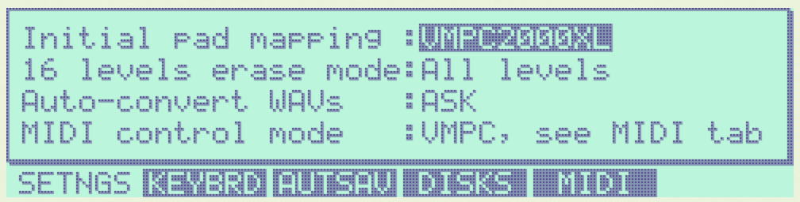
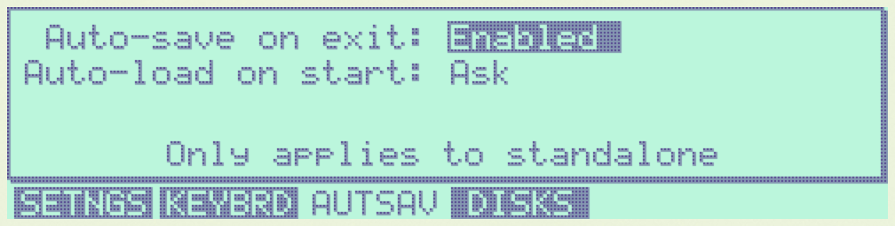

VMPC2000XL Specific Settings
============================

In this section we will discuss settings that can't be found on the real MPC2000XL. To access these settings, press :kbd:`Shift + 0`.

The SETNGS tab
--------------

Initial pad mapping
+++++++++++++++++++
The way all MPCs work is that each pad can be assigned a MIDI note number, and a note number can b assigned a sound, envelope settings and more. For a pad to play a sound, a MIDI note has to be assigned to it. This information is stored in programs and their associated :file:`PGM` files.

When a new program is created on the MPC2000XL, its default MIDI note mapping is pretty confusing. See https://www.mpc2000xl.com/pads.htm.

There are rumours this mapping stems from `General MIDI <https://en.wikipedia.org/wiki/General_MIDI#Percussion>`_.

Whatever its origins, it causes confusion the moment you connect a MIDI keyboard or pad controller to the real MPC2000XL. In this scenario, a typical expectation is that adjacent keys or pads on the connected MIDI device trigger adjacent pads on the MPC2000XL. Instead, pad 1 is triggered by note 37, pad 2 by note 36, pad 3 by note 42, pad 4 by note 82, etc.

VMPC2000XL defaults to a chromatic mapping: 37, 38, 39, 40 ... 95, 96, 97, 98 for pads 1, 2, 3, 4 ... 61, 62, 63, 64. You can verify this is the initial pad mapping in the :code:`SETNGS` tab. The :code:`Initial pad mapping` field should be set to :code:`VMPC2000XL` like below:

To get the original pad mapping, set :code:`Initial pad mapping` to :code:`ORIGINAL`.

.. note::

  Changes to this field are only applied to programs created after the change.

16 levels erase mode
++++++++++++++++++++
When 16 levels is enabled (see the green LED below :code:`16 LEVELS` in the top-right), the sequencer is running and the user holds the :code:`ERASE` button and any of the pads, the real MPC2000XL will erase all recorded note events that match the note that you set in the :code:`Assign 16 levels` window.

If this is what you want, leave the :code:`16 levels erase mode` field at its default setting: :code:`All levels`.

If you only want to erase note events that match the level of the pad you're pressing, set this field to :code:`Only pressed level` like below:

.. image:: images/vmpc_specific_settings/16_levels_erase_mode.png
   :width: 400 px
   :align: center

.. _configuring_the_keyboard:

Configuring the Keyboard in the KEYBRD tab
------------------------------------------
After pressing :code:`Shift + 0`, press :code:`F2` to go to the :code:`KEYBRD` tab.

If you can't use the keyboard as expected, you can also click the keyboard icon in the far top-right.

Once you are in the :code:`KEYBRD` tab, VMPC2000XL internally switches to a restricted keyboard input mode that ignores any keyboard configuration you may have. The only keys that work in this tab are:

* Up
* Down
* F1 ... F6

You can also use the mouse to interact with the Up/Down cursors and F1 ... F6 buttons in the UI as usual.

Changing a mapping
++++++++++++++++++

Use **up** and **down** to scroll through the list of functions. To change one of the mappings, highlight the mapping and press :code:`F4`. The UI will change to indicate learn mode is active. Some elements start blinking to indicate VMPC2000XL is awaiting your keypress:

As long as the elements are blinking and you see :code:`CANCEL` and :code:`ACCEPT`, you can press another key that you wish to assign to the selected function.

**To accept your new key you have to use the mouse or touchpad and click F4!** To cancel the learning process, use the mouse or touchpad and click F3.

Reset mapping to default
++++++++++++++++++++++++

To go back to the original mapping that is based on the US keyboard layout, press :code:`F5`:

.. image:: images/vmpc_specific_settings/reset_keyboard_mapping.png
   :width: 400 px
   :align: center

Saving mapping changes
++++++++++++++++++++++

Press :code:`F6` to save your changes. A popup will appear saying "Keyboard mapping saved". You can return to the Main screen by pressing :code:`Esc` and continue normal operation.

If your configuration is the same as what it was, a popup will appear saying "Keyboard mapping unchanged":

.. image:: images/vmpc_specific_settings/keyboard_mapping_unchanged.png
   :width: 400 px
   :align: center

Discard mapping changes
+++++++++++++++++++++++

To discard the changes you made in the :code:`KEYBRD` screen, press :code:`Esc` or click the :code:`MAIN SCREEN` button. If you actually have unsaved changes, the following window appears:

Besides discarding your changes, you can choose to stay in the :code:`KEYBRD` screen and continue making changes, or you can save your changes, after which you'll go to the Main screen.

Configuring auto-save in the AUTSAV tab
---------------------------------------

Though auto-save also happens when running VMPC2000XL as a plugin, these settings **only affect behaviour of the standalone version**.

The following aspects are part of the state that is saved and loaded as part of this feature in both standalone and plugin versions of VMPC2000XL:

* All programs and sounds
* All sequences
* Current screen
* Current focus in that screen
* Current sound (in TRIM, LOOP, etc.)
* Current directory (in LOAD and SAVE)

.. warning::

  Since all sounds are stored in your DAW project files, be aware of their combined size. If you have 32MB of sounds in memory, your project file will become 32MB bigger.

You can choose to auto-save upon exit and auto-load upon start. Both operations can be in 3 states:

* Disabled
* Ask
* Enabled

The default configuration is like this:

When :code:`Auto-save on exit` is set to :code:`Ask`, you will be asked whether to save your session or don't save (in which case **it will be deleted permanently**):

.. image:: images/vmpc_specific_settings/autosave_this_session.png
   :width: 400 px
   :align: center

When it's set to :code:`Disabled`, your sessions will never be auto-saved upon exiting VMPC2000XL. Likewise, when it's set to :code:`Enabled` your sessions will be silently auto-saved when you exit, **overwriting your previous auto-save**.

A similar logic applies to the :code:`Auto-load on start` setting. When it's set to :code:`Ask`, the following dialog appears upon startup if an auto-saved session is detected:

When it's set to :code:`Disabled`, your sessions will never be auto-saved when you exit. When it's set to :code:`Enabled` your sessions will be silently restored when you open VMPC2000XL.

