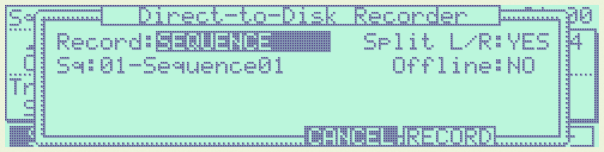
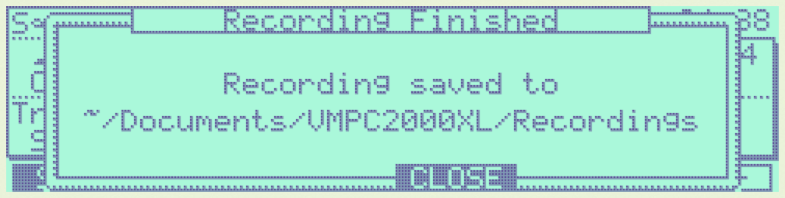
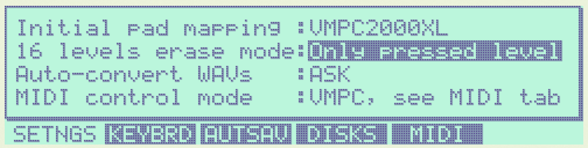
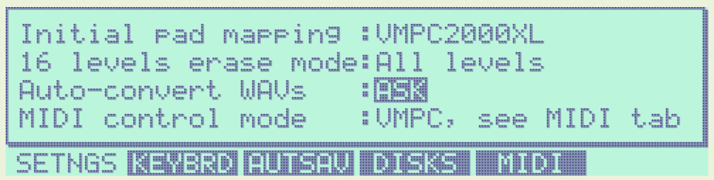
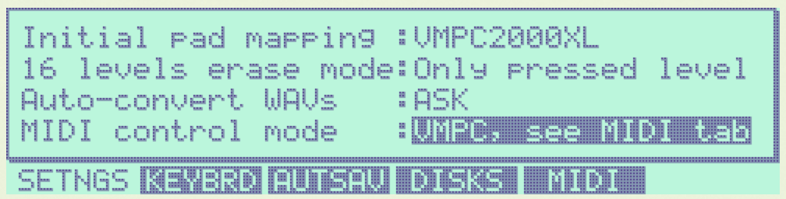
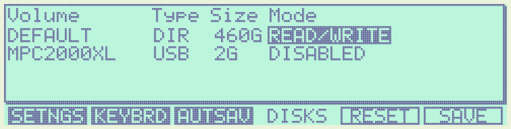
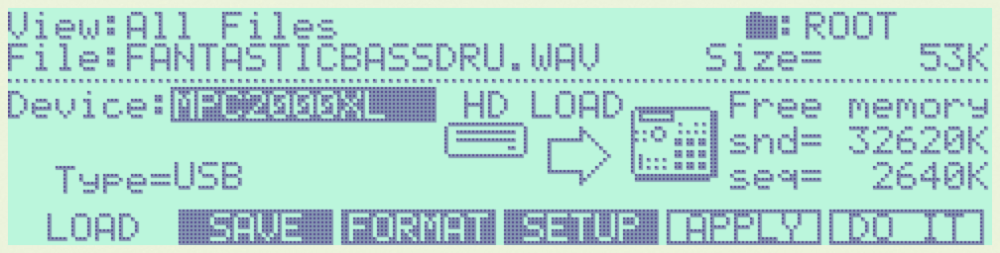
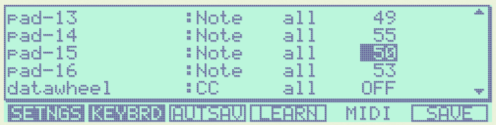
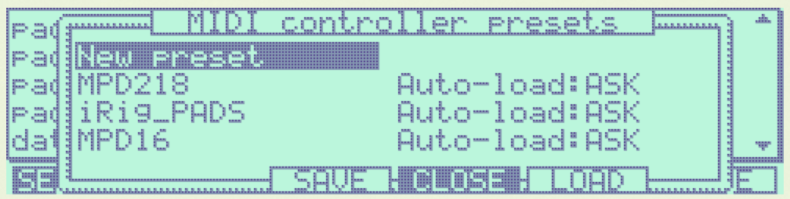
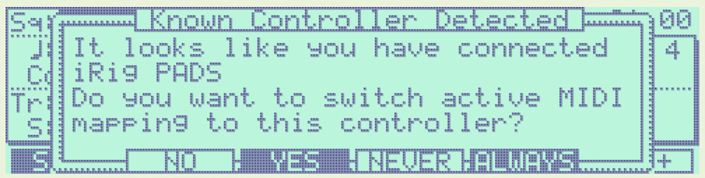

VMPC2000XL Specific Settings & Functionality
============================================

In this section we will discuss settings and functionality that can't be found on the real MPC2000XL.

Normalize
---------
Sometimes you want to boost the volume of soft (portions of) sounds.

When you're in the :code:`TRIM`, :code:`LOOP` or :code:`ZONE` screen, you can normalize the selection to 100% by following these steps:

1. Press :kbd:`F5` to open the :code:`Edit` window
2. Select :code:`NORMALIZE`
3. Press :kbd:`F5` to normalize

.. _direct_to_disk_recording:

Direct-to-disk recording a.k.a. bouncing
----------------------------------------
.. warning::

  This feature is currently experimental. Some options like :code:`JAM` and :code:`Split L/R` don't work yet. The recordings are always stored in the same directory, overwriting any previous ones. Additionally there will always be a set of 5 stereo recordings: :file:`L-R.WAV` and :file:`1-2.WAV` ... :file:`7-8.WAV`, even if one of these outputs is 100% silent.

VMPC2000XL allows various ways to record your beats and other projects directly to disk as WAV files. Often this is referred to as bouncing or rendering. This way you can take your VMPC2000XL creations to a DAW or sample editor for further processing.

You might for example want to master your instrumental beats by processing them with EQs, compressors and so on before sending them to someone who will add a vocal track on top. Or maybe you like to make drum tracks with VMPC2000XL, but you want to add synths and other layers in a DAW.

Press :kbd:`Shift + <PLAY START>` to access the :code:`Direct-to-Disk Recorder` screen. On a default US keyboard mapping the exact keyboard shortcut is :kbd:`Shift + \\`. You can also press and hold :kbd:`Shift` on your computer keyboard and click the :code:`PLAY START` button with the mouse.

The :code:`Direct-to-Disk Recorder` screen looks like this:

In the :code:`Record:` field you can select what to record: a :code:`SEQUENCE`, a :code:`LOOP` (i.e. a part of a sequence as selected in the :code:`Loop` window that is accessed via the :code:`MAIN` screen), a :code:`CUSTOM RANGE` or a :code:`SONG`. Different settings appear depending on what you have selected, to further configure what to record.

In the :code:`Offline:` field select :code:`YES` to enable silent, non-realtime rendering. This allows you to record even a few minutes worth of material in a matter of seconds, depending on the performance of your computer.

When recording has finished the following screen appears:

In the specified directory there will always be a set of 5 stereo recordings: :file:`L-R.WAV` and :file:`1-2.WAV` ... :file:`7-8.WAV`, even if one of these output pairs is 100% silent. Each recording reflects the output of a given stereo output of VMPC2000XL. If a particular pad is routed only to :code:`ASSIGNABLE MIX OUT 1/2` in the :code:`MIXER` screen, this is respected while recording directly to disk. This allows you to create up to 5 different stereo parts or stems that can be mixed and mastered in a DAW.

Like the :code:`Recording Finished` prompt indicates, **always move potentially valuable recordings out of the Recordings directory**! At the moment VMPC2000XL is not very smart about where to store its recordings and what the files are named, so any recording session will overwrite the previous one. This will be addressed in a future release of VMPC2000XL.

The SETNGS tab
--------------
Press :kbd:`Shift + 0` to go to the :code:`SETNGS` tab.

.. _initial_pad_mapping:

Initial pad mapping
+++++++++++++++++++
The way all MPCs work is that each pad can be assigned a MIDI note number, and a note number can b assigned a sound, envelope settings and more. For a pad to play a sound, a MIDI note has to be assigned to it. This information is stored in programs and their associated :file:`PGM` files.

When a new program is created on the MPC2000XL, its default MIDI note mapping is pretty confusing. See https://www.mpc2000xl.com/pads.htm.

There are rumours this mapping stems from `General MIDI <https://en.wikipedia.org/wiki/General_MIDI#Percussion>`_.

Whatever its origins, it causes confusion the moment you connect a MIDI keyboard to the real MPC2000XL. In this scenario, a typical expectation is that adjacent keys on the connected MIDI device trigger adjacent pads on the MPC2000XL. Instead, pad 1 is triggered by note 37, pad 2 by note 36, pad 3 by note 42, pad 4 by note 82, etc.

VMPC2000XL defaults to a chromatic mapping: 35, 36, 37, 38 ... 95, 96, 97, 98 for pads 1, 2, 3, 4 ... 61, 62, 63, 64. You can verify this is the initial pad mapping in the :code:`SETNGS` tab. The :code:`Initial pad mapping` field should be set to :code:`VMPC2000XL` like below:

.. image:: images/vmpc_specific_settings/initial_pad_mapping.png
   :width: 400 px
   :align: center

To get the original pad mapping, set :code:`Initial pad mapping` to :code:`ORIGINAL`.

.. note::

  Changes to this field are only applied to programs created after the change. Any MIDI input that can be mapped to a pad will do so regardless of the mapping in your programs.

16 levels erase mode
++++++++++++++++++++
When 16 levels is enabled (see the green LED below :code:`16 LEVELS` in the top-right), the sequencer is running and the user holds the :code:`ERASE` button and any of the pads, the real MPC2000XL will erase all recorded note events that match the note that you set in the :code:`Assign 16 levels` window.

If this is what you want, leave the :code:`16 levels erase mode` field at its default setting: :code:`All levels`.

If you only want to erase note events that match the level of the pad you're pressing, set this field to :code:`Only pressed level` like below:

Auto-convert WAVs
+++++++++++++++++
VMPC2000XL has the ability to convert PCM WAV files that are unsupported on the original MPC2000XL to a supported format. Eligible are 24- and 32-bit WAV files, as well as WAVs with a sampling rate over 44100Hz.

By default VMPC2000XL will always try to convert WAV files to a supported format. If you prefer to get a dialog instead, so you are aware of such conversions, set :code:`Auto-convert WAVs` to :code:`ASK`.

.. _midi_control_mode:

MIDI control mode
+++++++++++++++++
VMPC2000XL supports 2 different modes in terms of MIDI controllability:

1. :code:`VMPC`. This is the default mode as per v0.5.0. In this mode you can use predefined or customized MIDI control presets that match your MIDI controller. Supported commands are: pad 1 up to pad 16, datawheel (rotary), datawheel up, datawheel down, rec-gain, main-volume and all hardware buttons. The default presets maps notes 35 - 50 from any MIDI channel to pads 1 - 16, and control change 7 from any channel to the Note Variation Slider.

2. :code:`ORIGINAL`. VMPC2000XL will respond like the original would. This means that incoming MIDI note events will be routed to pads according to how you've programmed your pad-to-MIDI note associations in the PROGRAM ASSIGN screen (Shift + 6, F1 - F4). Please refer to the `MPC2000XL manual <https://www.platinumaudiolab.com/free_stuff/manuals/Akai/akai_mpc2000xl_manual.pdf>`_ (p185) to see the details of assigning MIDI Continuous Controllers to MPC2000XL functionality in this mode, via the :code:`MIDIsw` screen.

Continue reading below in the :ref:`MIDI control <midi_control>` section.

.. _configuring_the_keyboard:

Configuring the keyboard in the KEYBRD tab
------------------------------------------
After pressing :kbd:`Shift + 0`, press :kbd:`F2` to go to the :code:`KEYBRD` tab.

If you can't use the keyboard as expected, you can also click the keyboard icon in the far top-right.

.. image:: images/vmpc_specific_settings/keyboard_tab.png
   :width: 400 px
   :align: center

Once you are in the :code:`KEYBRD` tab, VMPC2000XL internally switches to a restricted keyboard input mode that ignores any keyboard configuration you may have. The only keys that work in this tab are:

* Up
* Down
* F1 ... F6

You can also use the mouse to interact with the Up/Down cursors and F1 ... F6 buttons in the UI as usual.

Changing a mapping
++++++++++++++++++

Use **up** and **down** to scroll through the list of functions. To change one of the mappings, highlight the mapping and press :code:`F4`. The UI will change to indicate learn mode is active. Some elements start blinking to indicate VMPC2000XL is awaiting your keypress:

.. image:: images/vmpc_specific_settings/keyboard_tab_learn.gif
   :width: 400 px
   :align: center

As long as the elements are blinking and you see :code:`CANCEL` and :code:`ACCEPT`, you can press another key that you wish to assign to the selected function.

**To accept your new key you have to use the mouse or touchpad and click F4.** To cancel the learning process, use the mouse or touchpad and click F3.

Reset mapping to default
++++++++++++++++++++++++

To go back to the original mapping that is based on the US keyboard layout, press :code:`F5`:

Saving mapping changes
++++++++++++++++++++++

Press :code:`F6` to save your changes. A popup will appear saying "Keyboard mapping saved". You can return to the Main screen by pressing :code:`Esc` and continue normal operation.

If your configuration is the same as what it was, a popup will appear saying "Keyboard mapping unchanged":

.. image:: images/vmpc_specific_settings/keyboard_mapping_unchanged.png
   :width: 400 px
   :align: center

Discard mapping changes
+++++++++++++++++++++++

To discard the changes you made in the :code:`KEYBRD` screen, press :code:`Esc` or click the :code:`MAIN SCREEN` button. If you actually have unsaved changes, the following window appears:

.. image:: images/vmpc_specific_settings/discard_mapping_changes.png
   :width: 400 px
   :align: center

Besides discarding your changes, you can choose to stay in the :code:`KEYBRD` screen and continue making changes, or you can save your changes, after which you'll go to the Main screen.

Configuring auto-save in the AUTSAV tab
---------------------------------------
After pressing :kbd:`Shift + 0`, press :kbd:`F3` to go to the :code:`AUTSAV` tab.

Though auto-save also happens when running VMPC2000XL as a plugin, these settings **only affect behaviour of the standalone version**.

The following aspects are part of the state that is saved and loaded as part of this feature in both standalone and plugin versions of VMPC2000XL:

* All programs and sounds
* All sequences
* Current screen
* Current focus in that screen
* Current sound (in TRIM, LOOP, etc.)
* Current directory (in LOAD and SAVE)

.. warning::

  Since all sounds are stored in your DAW project files, be aware of their combined size. If you have 32MB of sounds in memory, your project file will become 32MB bigger.

There are 2 auto-save modes:
* Disabled
* Enabled

and there are 3 auto-load modes:
* Disabled
* Ask
* Enabled

The default configuration is to enable auto-save, and to ask whether the user wants to auto-load the last saved state.

When :code:`Auto-load on start` is set to :code:`Ask`, the following dialog appears upon startup if an auto-saved session is detected:

.. image:: images/vmpc_specific_settings/continue_previous_session.png
   :width: 400 px
   :align: center

Configuring (USB) disk devices in the DISKS tab
-----------------------------------------------
.. warning::

  Read the instructions carefully to avoid corrupting CF cards and other media. Make backups if you're working with important data that you have no other copies of.

After pressing :kbd:`Shift + 0`, press :kbd:`F4` to go to the :code:`DISKS` tab. The default configuration is like this:

The DEFAULT volume
++++++++++++++++++

The :code:`DEFAULT` volume is the default directory where VMPC2000XL stores user data, including your sounds, programs and sequences. It is located in :file:`~/Documents/VMPC2000XL/Volumes/MPC2000XL`. This volume ensures VMPC2000XL is always in a useful state with regard to loading and saving SND, PGM and other files.

This behaviour deviates from the real MPC2000XL, in the sense that if no disk drive, CF reader or other disk device is connected to the real MPC2000XL, you will not be able to load or save anything.

The :code:`Mode` setting for the :code:`DEFAULT` volume can't be changed. It is always set to :code:`READ/WRITE`.

.. warning::

  Any files placed in the :code:`DEFAULT` directory will be renamed to names that are compatible with the Akai FAT16 filesystem. For example, :file:`Fantastic Bassdrum 14.wav` will become :file:`FANTASTICBASSDRU.WAV`. This is a destructive operation, meaning that the file in this location will be permanently renamed. For this reason it is recommended to always **keep a copy of the original files elsewhere**. Never assume you can copy files from this directory back into where you copied them from.

Raw USB volumes (Linux, macOS and Windows only)
+++++++++++++++++++++++++++++++++++++++++++++++
Raw USB access lets VMPC2000XL directly access your MPC2000XL CF cards. If you never use more than 8 characters for your sound names, this feature doesn't bring a lot of value to your workflow. If you want to use more than 8 characters for sound names, keep on reading.

Though a unique and cool feature of VMPC2000XL, **proceed with care** when using raw USB volume access. At the moment this feature is **experimental**.

If you plan to use raw USB access and you want to be able to use sound names longer than 8 characters, on macOS use my `FAT16 Mount Blocker <https://github.com/izzyreal/macos-fat16-mount-blocker>`_, and on Windows use my `registry patch <https://github.com/izzyreal/win-disable-usbdrive-indexing>`_. Note that these tools can also be used independently from VMPC2000XL, by original MPC2000XL users who want to be able to access MPC2000XL CF cards and other media on their desktop computer, without corrupting their data.

To my knowledge on most Linux distributions no special tools are necessary to prevent corruption of MPC2000XL media, but you must still stick to the principle of not performing any write operations (including creating, deleting and updating files) outside VMPC2000XL.

Akai's MPC2000XL FAT16 filesystem
^^^^^^^^^^^^^^^^^^^^^^^^^^^^^^^^^
This subsection should be seen as an addendum to Akai's MPC2000XL manual. It does not discuss anything that is directly related to VMPC2000XL.

The real MPC2000XL uses a hacky implementation of `FAT16 <https://www.win.tue.nl/~aeb/linux/fs/fat/fat-1.html>`_. In Akai's implementation, 8 bytes of each FAT directory entry that are ordinarily reserved for relatively trivial attributes like creation and last access date/time, are used to store 8 additional characters for the filename.

It is via this mechanism that the MPC2000XL has 16.3 filenames rather than 8.3 in a single FAT16 entry. The only problem, however, is that this leaves the MPC2000XL user in a kind of limbo state with regard to file exchange. Any Mac, Windows or Linux machine can read an MPC2000XL CF card without complaining, but it will not be able to parse the filenames correctly. It will register the 8 additional bytes as invalid date/time values, since that is what these bytes are expected to mean in a common FAT16 implementation.

For this reason, an MPC2000XL CF card with for example a :file:`DRUMKIT.PGM` that refers to a :file:`FUNKY_SNARE1.SND` will not be copied correctly to most computers. Likely you will end up with a file named :file:`FUNKY_SN.SND`.

What's worse, Windows and macOS have a tendency to rewrite the FAT entries of any volume that is connected to your system. This results in truncating file names, for example :file:`FUNKY_SNARE1.SND` will become :file:`FUNKY_SN.SND`. If you have :file:`PGM` files referring to :file:`FUNKY_SNARE1.SND`, loading such program files will result in failure to find the :file:`SND` file.

.. note::

  To avoid corrupting MPC2000XL data on a CF card, your options are:

  1. Never insert the CF card in a USB reader connected to your computer.
  2. Use up to 8 characters for the names of your sounds.
  3. Use my `FAT16 Mount Blocker <https://github.com/izzyreal/macos-fat16-mount-blocker>`_ for macOS.
  4. Use my `registry patch <https://github.com/izzyreal/win-disable-usbdrive-indexing>`_ for Windows.

**Always keep backups of important work!** If you don't have a hotswappable CF reader or SCSI harddrive connected to your MPC2000XL, your best bet for making backups is a Linux computer, or a Mac that is running `FAT16 Mount Blocker <https://github.com/izzyreal/macos-fat16-mount-blocker>`_.

RAW USB access under the hood
^^^^^^^^^^^^^^^^^^^^^^^^^^^^^
Raw USB volume access allows VMPC2000XL to read an MPC2000XL CF card almost like the MPC2000XL itself, meaning you can load and save PGM and APS files that refer to sounds with long names over 8 characters.

This type of access is achieved by performing the following steps:

1. VMPC2000XL unmounts a USB volume from the operating system (meaning macOS, Windows or Linux)
2. VMPC2000XL requests the operating system to provide it with exclusive access to the USB volume
3. VMPC2000XL can now read from and write to the USB volume at the byte level
4. VMPC2000XL gives up exclusive access to the USB volume
5. VMPC2000XL mounts the USB volume back to the operating system

Note that 3) is where all the action takes place that the user is interested in -- loading and saving SND, PGM, APS and other files. 

Steps 1, 2, 4 and 5 are only performed when necessary, which is typically at application startup and shutdown, and the first time a user configures a particular USB volume in VMPC2000XL.

Also note that step 2 and 4 require elevated permissions, so **you need to be a system administrator to make use of this functionality**.

Enabling a USB volume
^^^^^^^^^^^^^^^^^^^^^
When you first connect a USB pendrive or CF card with a FAT16 volume, the configuration in the DISKS screen will look like this:

.. note::

  Every time you go to the DISKS screen, VMPC2000XL will try to detect which USB volumes you have connected. There is no need to restart VMPC2000XL. If you happen to be in the DISKS screen while connecting a USB volume, go to another screen and go back to DISKS to refresh the list of volumes.

Navigate to the volume you want to enable and set its :code:`Mode` to :code:`READ-ONLY` or :code:`READ/WRITE`. If you want to make sure your volume is not altered by VMPC2000XL, set it to :code:`READ-ONLY`. When you are done configuring your volume(s), press :kbd:`F6` to save the configuration.

Any enabled volumes will now be available in the :code:`LOAD` screen's :code:`Device:` field. The volume name will be used to identify each volume. Where the real MPC2000XL instantly makes SCSI and other connected devices your active disk device as you cycle through them, one additional action is required on VMPC2000XL to make a USB volume active -- pressing :kbd:`F5` to :code:`APPLY` that setting:

The reason for this deviation from the real MPC2000XL is to allow the user to explore any options before actually changing the active disk device.

If after pressing :code:`APPLY` no error messages appear, your USB volume is ready for load operations, and for save operations as well, if you configured :code:`READ/WRITE` earlier in the :code:`DISKS` screen.

VMPC2000XL remembers configurations for any USB volumes that have been previously connected and enabled, as well as the :code:`Device:` you used in the last session. In other words, after a restart it is easy to continue using your USB volume (though you may be asked for administrator permissions again).

.. _midi_control:

MIDI control
------------
From the :code:`SETNGS` screen press :kbd:`F5` to access the :code:`MIDI` tab:

Each row shows an association between an interactable component of VMPC2000XL, and a specific kind of MIDI input message that should control it.

The first column allows you to specify a status, either :code:`CC` or :code:`Note`.

The second column lets you specify a MIDI channel, which can also be set to :code:`all`.

The third column lets you specify a value to filter by, which for a note message applies to the note number, and for a continuous controller message it applies to the controller number. This value can be set to :code:`OFF` to disable a row.

Press :kbd:`F4` to toggle :code:`LEARN` mode. You can also use the cursors and DATA wheel to modify associations.

When you leave the screen, VMPC2000XL checks if you've made any changes and whether you'd like to save them. When you restart VMPC2000XL, these settings will be automatically restored.

MIDI control preset management
++++++++++++++++++++++++++++++
In the :code:`MIDI` screen press :kbd:`OPEN WINDOW` to open the :code:`MIDI controller presets` window:

To load the default preset, press :kbd:`F5` while :code:`New preset` is selected. The default preset is very basic: notes 35 - 50 are associated with pads 1 - 16, and CC 7 is associated with the slider.

You can also load any of the named presets by selecting one and pressing :kbd:`F5`.

To save your own preset under a name, select :code:`New preset` and press :kbd:`F3`. You can also overwrite any of the existing presets this way.

Presets are stored as files under :code:`~/Documents/VMPC2000XL/MidiControlPresets`.

Bundled presets for known controllers
+++++++++++++++++++++++++++++++++++++
VMPC2000XL aims to support common pad controllers out-of-the-box. When a known controller is connected, VMPC2000XL detects this and asks if you want to switch the active MIDI control mapping to one for your controller:

The process of adding known controller mappings has just started, so the current list is quite small:

* Akai MPD16 and early MPC family
* Akai MPD218
* iRig PADS

Let me know which controller you use and I'll try to add it.

If you have accidentally overwritten a bundled preset, delete its file from :code:`~/Documents/VMPC2000XL/MidiControlPresets` and the next time you start VMPC2000XL the original preset will be restored.

Auxiliary LCD
-------------
In some cases it can be useful to have a bigger view on the LCD, maybe even on a dedicated display. Open an additional window that displays just the LCD by double-clicking on the normal LCD. A window with duplicate contents of the LCD will show up. You can drag the window around, resize it and maximize it. To close it, double-click it or double-click the normal LCD.

Custom Skin
-----------
See https://github.com/izzyreal/vmpc-juce/tree/master/resources/img for the original bitmaps. Place files with those file names in :code:`~/Documents/VMPC2000XL/Skin` to override the originals. The files that will be picked up by this feature are:

* :code:`bg.jpg`
* :code:`datawheels.jpg`
* :code:`sliders.jpg`

Let me know if you need other parts to be skinnable as well.